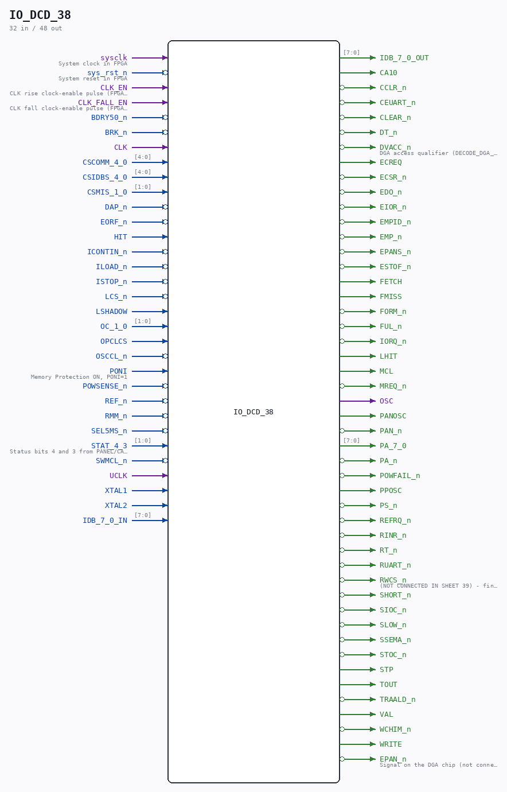

# IO_DCD_38

Source: `/mnt/e/Dev/Repos/Ronny/nd-120/Verilog/CPU-BOARD-3202/circuit/IO_DCD_38.v`

> Generated by `Verilog/tests/module_doc.py` from the `//!`
> comments in the source. Do not edit by hand - edit the RTL comments and regenerate.

## Description

ND120 CPU, MM&M
IO/DCD
IO DECODING
SHEET 38 of 50
Last reviewed: 14-DEC-2024
Ronny Hansen

## Ports

| Direction | Width | Name | Description |
|---|---|---|---|
| input | `1` | `sysclk` | System clock in FPGA |
| input | `1` | `sys_rst_n` *(active low)* | System reset in FPGA |
| input | `1` | `CLK_EN` | CLK rise clock-enable pulse (FPGA_FF_MODE, else 0) |
| input | `1` | `CLK_FALL_EN` | CLK fall clock-enable pulse (FPGA_FF_MODE, else 0) |
| input | `1` | `BDRY50_n` *(active low)* |  |
| input | `1` | `BRK_n` *(active low)* |  |
| input | `1` | `CLK` |  |
| input | `[4:0]` | `CSCOMM_4_0` |  |
| input | `[4:0]` | `CSIDBS_4_0` |  |
| input | `[1:0]` | `CSMIS_1_0` |  |
| input | `1` | `DAP_n` *(active low)* |  |
| input | `1` | `EORF_n` *(active low)* |  |
| input | `1` | `HIT` |  |
| input | `1` | `ICONTIN_n` *(active low)* |  |
| input | `1` | `ILOAD_n` *(active low)* |  |
| input | `1` | `ISTOP_n` *(active low)* |  |
| input | `1` | `LCS_n` *(active low)* |  |
| input | `1` | `LSHADOW` |  |
| input | `[1:0]` | `OC_1_0` |  |
| input | `1` | `OPCLCS` |  |
| input | `1` | `OSCCL_n` *(active low)* |  |
| input | `1` | `PONI` | Memory Protection ON, PONI=1 |
| input | `1` | `POWSENSE_n` *(active low)* |  |
| input | `1` | `REF_n` *(active low)* |  |
| input | `1` | `RMM_n` *(active low)* |  |
| input | `1` | `SEL5MS_n` *(active low)* |  |
| input | `[1:0]` | `STAT_4_3` | Status bits 4 and 3 from PANEL/CALENDAR CPU 68705 |
| input | `1` | `SWMCL_n` *(active low)* |  |
| input | `1` | `UCLK` |  |
| input | `1` | `XTAL1` |  |
| input | `1` | `XTAL2` |  |
| input | `[7:0]` | `IDB_7_0_IN` |  |
| output | `[7:0]` | `IDB_7_0_OUT` |  |
| output | `1` | `CA10` |  |
| output | `1` | `CCLR_n` *(active low)* |  |
| output | `1` | `CEUART_n` *(active low)* |  |
| output | `1` | `CLEAR_n` *(active low)* |  |
| output | `1` | `DT_n` *(active low)* |  |
| output | `1` | `DVACC_n` *(active low)* | DGA access qualifier (DECODE_DGA_COMM A227, arrives as XDVN) - not the CGA's VACC |
| output | `1` | `ECREQ` |  |
| output | `1` | `ECSR_n` *(active low)* |  |
| output | `1` | `EDO_n` *(active low)* |  |
| output | `1` | `EIOR_n` *(active low)* |  |
| output | `1` | `EMPID_n` *(active low)* |  |
| output | `1` | `EMP_n` *(active low)* |  |
| output | `1` | `EPANS_n` *(active low)* |  |
| output | `1` | `ESTOF_n` *(active low)* |  |
| output | `1` | `FETCH` |  |
| output | `1` | `FMISS` |  |
| output | `1` | `FORM_n` *(active low)* |  |
| output | `1` | `FUL_n` *(active low)* |  |
| output | `1` | `IORQ_n` *(active low)* |  |
| output | `1` | `LHIT` |  |
| output | `1` | `MCL` |  |
| output | `1` | `MREQ_n` *(active low)* |  |
| output | `1` | `OSC` |  |
| output | `1` | `PANOSC` |  |
| output | `1` | `PAN_n` *(active low)* |  |
| output | `[7:0]` | `PA_7_0` |  |
| output | `1` | `PA_n` *(active low)* |  |
| output | `1` | `POWFAIL_n` *(active low)* |  |
| output | `1` | `PPOSC` |  |
| output | `1` | `PS_n` *(active low)* |  |
| output | `1` | `REFRQ_n` *(active low)* |  |
| output | `1` | `RINR_n` *(active low)* |  |
| output | `1` | `RT_n` *(active low)* |  |
| output | `1` | `RUART_n` *(active low)* |  |
| output | `1` | `RWCS_n` *(active low)* | (NOT CONNECTED IN SHEET 39) - find signal from one of the PAL's ?? |
| output | `1` | `SHORT_n` *(active low)* |  |
| output | `1` | `SIOC_n` *(active low)* |  |
| output | `1` | `SLOW_n` *(active low)* |  |
| output | `1` | `SSEMA_n` *(active low)* |  |
| output | `1` | `STOC_n` *(active low)* |  |
| output | `1` | `STP` |  |
| output | `1` | `TOUT` |  |
| output | `1` | `TRAALD_n` *(active low)* |  |
| output | `1` | `VAL` |  |
| output | `1` | `WCHIM_n` *(active low)* |  |
| output | `1` | `WRITE` |  |
| output | `1` | `EPAN_n` *(active low)* | Signal on the DGA chip (not connected in sheet 39). Maybe replaced by a PAL? |
