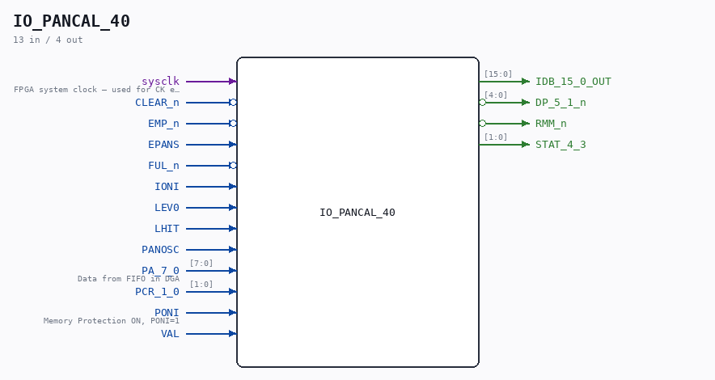

# IO_PANCAL_40

Source: `/mnt/e/Dev/Repos/Ronny/nd-120/Verilog/CPU-BOARD-3202/circuit/IO_PANCAL_40.v`

> Generated by `Verilog/tests/module_doc.py` from the `//!`
> comments in the source. Do not edit by hand - edit the RTL comments and regenerate.

## Description

ND120 CPU, MM&M
IO/PANCAL
PANEL PROC & CALENDAR
SHEET 40 of 50
Last reviewed: 2-FEB-2025
Ronny Hansen

## Ports

| Direction | Width | Name | Description |
|---|---|---|---|
| input | `1` | `sysclk` | FPGA system clock — used for CK edge detection in CHIP_32B |
| input | `1` | `CLEAR_n` *(active low)* |  |
| input | `1` | `EMP_n` *(active low)* |  |
| input | `1` | `EPANS` |  |
| input | `1` | `FUL_n` *(active low)* |  |
| input | `1` | `IONI` |  |
| input | `1` | `LEV0` |  |
| input | `1` | `LHIT` |  |
| input | `1` | `PANOSC` |  |
| input | `[7:0]` | `PA_7_0` | Data from FIFO in DGA |
| input | `[1:0]` | `PCR_1_0` |  |
| input | `1` | `PONI` | Memory Protection ON, PONI=1 |
| input | `1` | `VAL` |  |
| output | `[15:0]` | `IDB_15_0_OUT` |  |
| output | `[4:0]` | `DP_5_1_n` *(active low)* |  |
| output | `1` | `RMM_n` *(active low)* |  |
| output | `[1:0]` | `STAT_4_3` |  |
