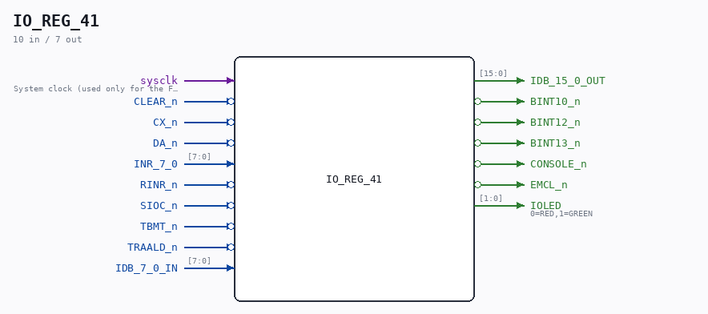

# IO_REG_41

Source: `/mnt/e/Dev/Repos/Ronny/nd-120/Verilog/CPU-BOARD-3202/circuit/IO_REG_41.v`

> Generated by `Verilog/tests/module_doc.py` from the `//!`
> comments in the source. Do not edit by hand - edit the RTL comments and regenerate.

## Description

ND120 CPU, MM&M
IO/REG
IOC, ALD & INR REGS
SHEET 41 of 50
Last reviewed: 2-FEB-2025
Ronny Hansen

## Ports

| Direction | Width | Name | Description |
|---|---|---|---|
| input | `1` | `sysclk` | System clock (used only for the FF-mode strobe edge-capture) |
| input | `1` | `CLEAR_n` *(active low)* |  |
| input | `1` | `CX_n` *(active low)* |  |
| input | `1` | `DA_n` *(active low)* |  |
| input | `[7:0]` | `INR_7_0` |  |
| input | `1` | `RINR_n` *(active low)* |  |
| input | `1` | `SIOC_n` *(active low)* |  |
| input | `1` | `TBMT_n` *(active low)* |  |
| input | `1` | `TRAALD_n` *(active low)* |  |
| input | `[7:0]` | `IDB_7_0_IN` |  |
| output | `[15:0]` | `IDB_15_0_OUT` |  |
| output | `1` | `BINT10_n` *(active low)* |  |
| output | `1` | `BINT12_n` *(active low)* |  |
| output | `1` | `BINT13_n` *(active low)* |  |
| output | `1` | `CONSOLE_n` *(active low)* |  |
| output | `1` | `EMCL_n` *(active low)* |  |
| output | `[1:0]` | `IOLED` | 0=RED,1=GREEN |
