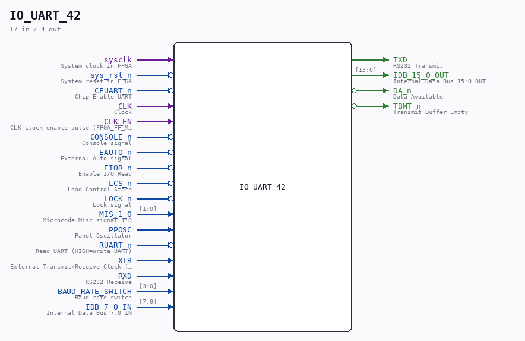

# IO_UART_42

Source: `/mnt/e/Dev/Repos/Ronny/nd-120/Verilog/CPU-BOARD-3202/circuit/IO_UART_42.v`

> Generated by `Verilog/tests/module_doc.py` from the `//!`
> comments in the source. Do not edit by hand - edit the RTL comments and regenerate.

## Description

ND120 CPU, MM&M
IO/UART
UART & IOR REG
SHEET 42 of 50
Last reviewed: 14-DEC-2024
Ronny Hansen

## Ports

| Direction | Width | Name | Description |
|---|---|---|---|
| input | `1` | `sysclk` | System clock in FPGA |
| input | `1` | `sys_rst_n` *(active low)* | System reset in FPGA |
| input | `1` | `CEUART_n` *(active low)* | Chip Enable UART |
| input | `1` | `CLK` | Clock |
| input | `1` | `CLK_EN` | CLK clock-enable pulse (FPGA_FF_MODE, else 0) |
| input | `1` | `CONSOLE_n` *(active low)* | Console signal |
| input | `1` | `EAUTO_n` *(active low)* | External Auto signal |
| input | `1` | `EIOR_n` *(active low)* | Enable I/O Read |
| input | `1` | `LCS_n` *(active low)* | Load Control Store |
| input | `1` | `LOCK_n` *(active low)* | Lock signal |
| input | `[1:0]` | `MIS_1_0` | Microcode Misc signal 1:0 |
| input | `1` | `PPOSC` | Panel Oscillator |
| input | `1` | `RUART_n` *(active low)* | Read UART (HIGH=Write UART) |
| input | `1` | `XTR` | External Transmit/Receive Clock (not used) |
| input | `1` | `RXD` | RS232 Receive |
| output | `1` | `TXD` | RS232 Transmit |
| input | `[3:0]` | `BAUD_RATE_SWITCH` | Baud rate switch |
| input | `[7:0]` | `IDB_7_0_IN` | Internal Data Bus 7:0 IN |
| output | `[15:0]` | `IDB_15_0_OUT` | Internal Data Bus 15:0 OUT |
| output | `1` | `DA_n` *(active low)* | Data Available |
| output | `1` | `TBMT_n` *(active low)* | Transmit Buffer Empty |
