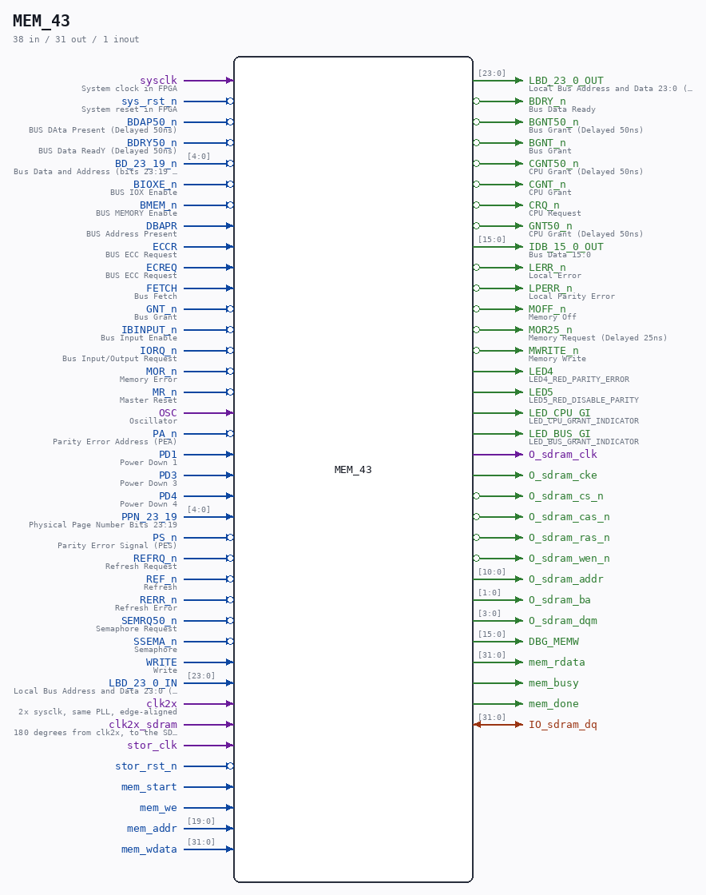

# MEM_43

Source: `/mnt/e/Dev/Repos/Ronny/nd-120/Verilog/CPU-BOARD-3202/circuit/MEM_43.v`

> Generated by `Verilog/tests/module_doc.py` from the `//!`
> comments in the source. Do not edit by hand - edit the RTL comments and regenerate.

## Description

ND120 CPU, MM&M
MEM
MEMORY TOP LEVEL
SHEET 43 of 50
Last reviewed: 22-MAR-2025
Ronny Hansen

## Ports

| Direction | Width | Name | Description |
|---|---|---|---|
| input | `1` | `sysclk` | System clock in FPGA |
| input | `1` | `sys_rst_n` *(active low)* | System reset in FPGA |
| input | `1` | `BDAP50_n` *(active low)* | BUS DAta Present (Delayed 50ns) |
| input | `1` | `BDRY50_n` *(active low)* | BUS Data ReadY (Delayed 50ns) |
| input | `[4:0]` | `BD_23_19_n` *(active low)* | Bus Data and Address (bits 23:19 negated) |
| input | `1` | `BIOXE_n` *(active low)* | BUS IOX Enable |
| input | `1` | `BMEM_n` *(active low)* | BUS MEMORY Enable |
| input | `1` | `DBAPR` | BUS Address Present |
| input | `1` | `ECCR` | BUS ECC Request |
| input | `1` | `ECREQ` | BUS ECC Request |
| input | `1` | `FETCH` | Bus Fetch |
| input | `1` | `GNT_n` *(active low)* | Bus Grant |
| input | `1` | `IBINPUT_n` *(active low)* | Bus Input Enable |
| input | `1` | `IORQ_n` *(active low)* | Bus Input/Output Request |
| input | `1` | `MOR_n` *(active low)* | Memory Error |
| input | `1` | `MR_n` *(active low)* | Master Reset |
| input | `1` | `OSC` | Oscillator |
| input | `1` | `PA_n` *(active low)* | Parity Error Address (PEA) |
| input | `1` | `PD1` | Power Down 1 |
| input | `1` | `PD3` | Power Down 3 |
| input | `1` | `PD4` | Power Down 4 |
| input | `[4:0]` | `PPN_23_19` | Physical Page Number Bits 23:19 |
| input | `1` | `PS_n` *(active low)* | Parity Error Signal (PES) |
| input | `1` | `REFRQ_n` *(active low)* | Refresh Request |
| input | `1` | `REF_n` *(active low)* | Refresh |
| input | `1` | `RERR_n` *(active low)* | Refresh Error |
| input | `1` | `SEMRQ50_n` *(active low)* | Semaphore Request |
| input | `1` | `SSEMA_n` *(active low)* | Semaphore |
| input | `1` | `WRITE` | Write |
| input | `[23:0]` | `LBD_23_0_IN` | Local Bus Address and Data 23:0 (IN) -  Address and Data for RAM |
| output | `[23:0]` | `LBD_23_0_OUT` | Local Bus Address and Data 23:0 (OUT) - Data from from RAM (15:0) |
| output | `1` | `BDRY_n` *(active low)* | Bus Data Ready |
| output | `1` | `BGNT50_n` *(active low)* | Bus Grant (Delayed 50ns) |
| output | `1` | `BGNT_n` *(active low)* | Bus Grant |
| output | `1` | `CGNT50_n` *(active low)* | CPU Grant (Delayed 50ns) |
| output | `1` | `CGNT_n` *(active low)* | CPU Grant |
| output | `1` | `CRQ_n` *(active low)* | CPU Request |
| output | `1` | `GNT50_n` *(active low)* | CPU Grant (Delayed 50ns) |
| output | `[15:0]` | `IDB_15_0_OUT` | Bus Data 15:0 |
| output | `1` | `LERR_n` *(active low)* | Local Error |
| output | `1` | `LPERR_n` *(active low)* | Local Parity Error |
| output | `1` | `MOFF_n` *(active low)* | Memory Off |
| output | `1` | `MOR25_n` *(active low)* | Memory Request (Delayed 25ns) |
| output | `1` | `MWRITE_n` *(active low)* | Memory Write |
| output | `1` | `LED4` | LED4_RED_PARITY_ERROR |
| output | `1` | `LED5` | LED5_RED_DISABLE_PARITY |
| output | `1` | `LED_CPU_GI` | LED_CPU_GRANT_INDICATOR |
| output | `1` | `LED_BUS_GI` | LED_BUS_GRANT_INDICATOR |
| input | `1` | `clk2x` | 2x sysclk, same PLL, edge-aligned |
| input | `1` | `clk2x_sdram` | 180 degrees from clk2x, to the SDRAM chip |
| output | `1` | `O_sdram_clk` |  |
| output | `1` | `O_sdram_cke` |  |
| output | `1` | `O_sdram_cs_n` *(active low)* |  |
| output | `1` | `O_sdram_cas_n` *(active low)* |  |
| output | `1` | `O_sdram_ras_n` *(active low)* |  |
| output | `1` | `O_sdram_wen_n` *(active low)* |  |
| inout | `[31:0]` | `IO_sdram_dq` |  |
| output | `[10:0]` | `O_sdram_addr` |  |
| output | `[1:0]` | `O_sdram_ba` |  |
| output | `[3:0]` | `O_sdram_dqm` |  |
| output | `[15:0]` | `DBG_MEMW` |  |
| input | `1` | `stor_clk` |  |
| input | `1` | `stor_rst_n` *(active low)* |  |
| input | `1` | `mem_start` |  |
| input | `1` | `mem_we` |  |
| input | `[19:0]` | `mem_addr` |  |
| input | `[31:0]` | `mem_wdata` |  |
| output | `[31:0]` | `mem_rdata` |  |
| output | `1` | `mem_busy` |  |
| output | `1` | `mem_done` |  |
