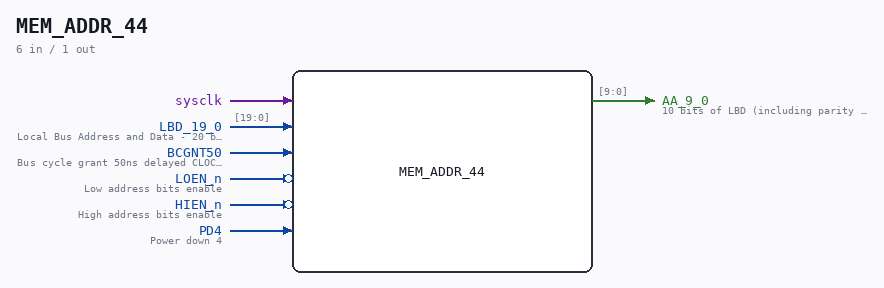

# MEM_ADDR_44

Source: `/mnt/e/Dev/Repos/Ronny/nd-120/Verilog/CPU-BOARD-3202/circuit/MEM_ADDR_44.v`

> Generated by `Verilog/tests/module_doc.py` from the `//!`
> comments in the source. Do not edit by hand - edit the RTL comments and regenerate.

## Description

ND120 CPU, MM&M
MEM/ADDR
MEM ADDR MUX
SHEET 44 of 50
Last reviewed: 2-FEB-2025
Ronny Hansen

## Ports

| Direction | Width | Name | Description |
|---|---|---|---|
| input | `1` | `sysclk` |  |
| input | `[19:0]` | `LBD_19_0` | Local Bus Address and Data - 20 bits (including parity 2 bits) |
| input | `1` | `BCGNT50` | Bus cycle grant 50ns delayed CLOCK signal to latch LOW or HIGH bits from memory to AA_9_0 |
| input | `1` | `LOEN_n` *(active low)* | Low address bits enable |
| input | `1` | `HIEN_n` *(active low)* | High address bits enable |
| input | `1` | `PD4` | Power down 4 |
| output | `[9:0]` | `AA_9_0` | 10 bits of LBD (including parity in bit 10)- 10 bit input to MEM/RAM |
