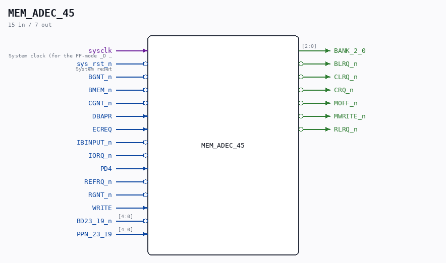

# MEM_ADEC_45

Source: `/mnt/e/Dev/Repos/Ronny/nd-120/Verilog/CPU-BOARD-3202/circuit/MEM_ADEC_45.v`

> Generated by `Verilog/tests/module_doc.py` from the `//!`
> comments in the source. Do not edit by hand - edit the RTL comments and regenerate.

## Description

ND120 CPU, MM&M
MEM/ADEC
ADDRESS DECODERS
SHEET 45 of 50
Last reviewed: 22-MAR-2025
Ronny Hansen

## Ports

| Direction | Width | Name | Description |
|---|---|---|---|
| input | `1` | `sysclk` | System clock (for the FF-mode _D PAL mirrors) |
| input | `1` | `sys_rst_n` *(active low)* | System reset |
| input | `1` | `BGNT_n` *(active low)* |  |
| input | `1` | `BMEM_n` *(active low)* |  |
| input | `1` | `CGNT_n` *(active low)* |  |
| input | `1` | `DBAPR` |  |
| input | `1` | `ECREQ` |  |
| input | `1` | `IBINPUT_n` *(active low)* |  |
| input | `1` | `IORQ_n` *(active low)* |  |
| input | `1` | `PD4` |  |
| input | `1` | `REFRQ_n` *(active low)* |  |
| input | `1` | `RGNT_n` *(active low)* |  |
| input | `1` | `WRITE` |  |
| input | `[4:0]` | `BD23_19_n` *(active low)* |  |
| input | `[4:0]` | `PPN_23_19` |  |
| output | `[2:0]` | `BANK_2_0` |  |
| output | `1` | `BLRQ_n` *(active low)* |  |
| output | `1` | `CLRQ_n` *(active low)* |  |
| output | `1` | `CRQ_n` *(active low)* |  |
| output | `1` | `MOFF_n` *(active low)* |  |
| output | `1` | `MWRITE_n` *(active low)* |  |
| output | `1` | `RLRQ_n` *(active low)* |  |
