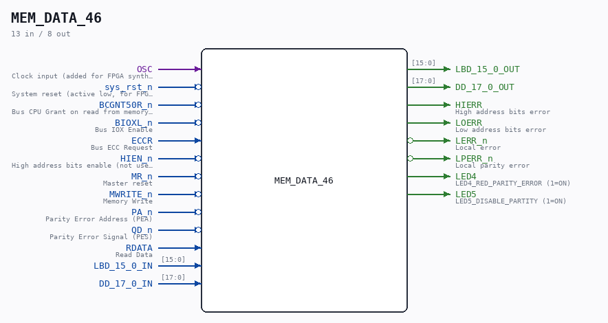

# MEM_DATA_46

Source: `/mnt/e/Dev/Repos/Ronny/nd-120/Verilog/CPU-BOARD-3202/circuit/MEM_DATA_46.v`

> Generated by `Verilog/tests/module_doc.py` from the `//!`
> comments in the source. Do not edit by hand - edit the RTL comments and regenerate.

## Description

ND120 CPU, MM&M
MEM/DATA
DATA & PARITY TCV
SHEET 46 of 50
Last reviewed: 22-MAR-2025
Ronny Hansen

## Ports

| Direction | Width | Name | Description |
|---|---|---|---|
| input | `1` | `OSC` | Clock input (added for FPGA synthesis) |
| input | `1` | `sys_rst_n` *(active low)* | System reset (active low, for FPGA synthesis) |
| input | `1` | `BCGNT50R_n` *(active low)* | Bus CPU Grant on read from memory after the address (from 50 ns after GNT on read cycle) |
| input | `1` | `BIOXL_n` *(active low)* | Bus IOX Enable |
| input | `1` | `ECCR` | Bus ECC Request |
| input | `1` | `HIEN_n` *(active low)* | High address bits enable (not used) |
| input | `1` | `MR_n` *(active low)* | Master reset |
| input | `1` | `MWRITE_n` *(active low)* | Memory Write |
| input | `1` | `PA_n` *(active low)* | Parity Error Address (PEA) |
| input | `1` | `QD_n` *(active low)* | Parity Error Signal (PES) |
| input | `1` | `RDATA` | Read Data |
| input | `[15:0]` | `LBD_15_0_IN` |  |
| output | `[15:0]` | `LBD_15_0_OUT` |  |
| input | `[17:0]` | `DD_17_0_IN` |  |
| output | `[17:0]` | `DD_17_0_OUT` |  |
| output | `1` | `HIERR` | High address bits error |
| output | `1` | `LOERR` | Low address bits error |
| output | `1` | `LERR_n` *(active low)* | Local error |
| output | `1` | `LPERR_n` *(active low)* | Local parity error |
| output | `1` | `LED4` | LED4_RED_PARITY_ERROR (1=ON) |
| output | `1` | `LED5` | LED5_DISABLE_PARTITY (1=ON) |
