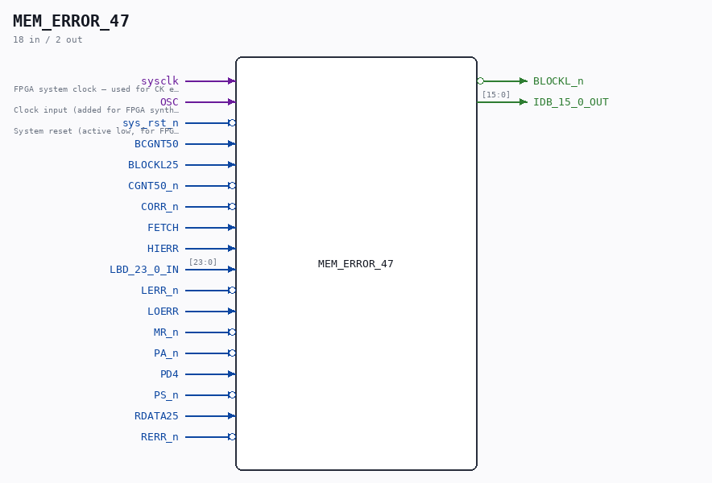

# MEM_ERROR_47

Source: `/mnt/e/Dev/Repos/Ronny/nd-120/Verilog/CPU-BOARD-3202/circuit/MEM_ERROR_47.v`

> Generated by `Verilog/tests/module_doc.py` from the `//!`
> comments in the source. Do not edit by hand - edit the RTL comments and regenerate.

## Description

ND120 CPU, MM&M
MEM/ERROR
LOCAL PES & PEA
SHEET 47 of 50
Last reviewed: 21-APRIL-2024
Ronny Hansen

## Ports

| Direction | Width | Name | Description |
|---|---|---|---|
| input | `1` | `sysclk` | FPGA system clock — used for CK edge detection |
| input | `1` | `OSC` | Clock input (added for FPGA synthesis) |
| input | `1` | `sys_rst_n` *(active low)* | System reset (active low, for FPGA synthesis) |
| input | `1` | `BCGNT50` |  |
| input | `1` | `BLOCKL25` |  |
| input | `1` | `CGNT50_n` *(active low)* |  |
| input | `1` | `CORR_n` *(active low)* |  |
| input | `1` | `FETCH` |  |
| input | `1` | `HIERR` |  |
| input | `[23:0]` | `LBD_23_0_IN` |  |
| input | `1` | `LERR_n` *(active low)* |  |
| input | `1` | `LOERR` |  |
| input | `1` | `MR_n` *(active low)* |  |
| input | `1` | `PA_n` *(active low)* |  |
| input | `1` | `PD4` |  |
| input | `1` | `PS_n` *(active low)* |  |
| input | `1` | `RDATA25` |  |
| input | `1` | `RERR_n` *(active low)* |  |
| output | `1` | `BLOCKL_n` *(active low)* |  |
| output | `[15:0]` | `IDB_15_0_OUT` |  |
