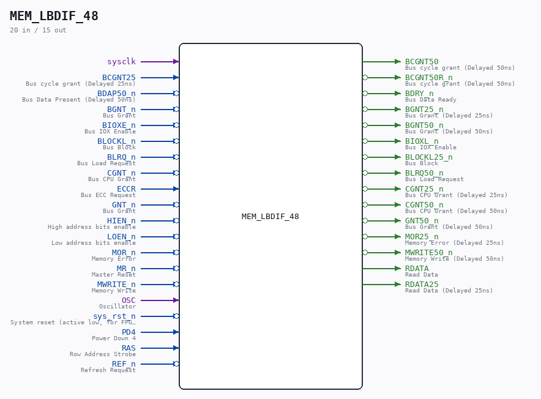

# MEM_LBDIF_48

Source: `/mnt/e/Dev/Repos/Ronny/nd-120/Verilog/CPU-BOARD-3202/circuit/MEM_LBDIF_48.v`

> Generated by `Verilog/tests/module_doc.py` from the `//!`
> comments in the source. Do not edit by hand - edit the RTL comments and regenerate.

## Description

ND120 CPU, MM&M
MEM/LBDIF
LOCAL BD CONTROL
SHEET 48 of 50
Last reviewed: 2-FEB-2025
Ronny Hansen

## Ports

| Direction | Width | Name | Description |
|---|---|---|---|
| input | `1` | `sysclk` |  |
| input | `1` | `BCGNT25` | Bus cycle grant (Delayed 25ns) |
| input | `1` | `BDAP50_n` *(active low)* | Bus Data Present (Delayed 50ns) |
| input | `1` | `BGNT_n` *(active low)* | Bus Grant |
| input | `1` | `BIOXE_n` *(active low)* | Bus IOX Enable |
| input | `1` | `BLOCKL_n` *(active low)* | Bus Block |
| input | `1` | `BLRQ_n` *(active low)* | Bus Load Request |
| input | `1` | `CGNT_n` *(active low)* | Bus CPU Grant |
| input | `1` | `ECCR` | Bus ECC Request |
| input | `1` | `GNT_n` *(active low)* | Bus Grant |
| input | `1` | `HIEN_n` *(active low)* | High address bits enable |
| input | `1` | `LOEN_n` *(active low)* | Low address bits enable |
| input | `1` | `MOR_n` *(active low)* | Memory Error |
| input | `1` | `MR_n` *(active low)* | Master Reset |
| input | `1` | `MWRITE_n` *(active low)* | Memory Write |
| input | `1` | `OSC` | Oscillator |
| input | `1` | `sys_rst_n` *(active low)* | System reset (active low, for FPGA synthesis) |
| input | `1` | `PD4` | Power Down 4 |
| input | `1` | `RAS` | Row Address Strobe |
| input | `1` | `REF_n` *(active low)* | Refresh Request |
| output | `1` | `BCGNT50` | Bus cycle grant (Delayed 50ns) |
| output | `1` | `BCGNT50R_n` *(active low)* | Bus cycle grant (Delayed 50ns) |
| output | `1` | `BDRY_n` *(active low)* | Bus Data Ready |
| output | `1` | `BGNT25_n` *(active low)* | Bus Grant (Delayed 25ns) |
| output | `1` | `BGNT50_n` *(active low)* | Bus Grant (Delayed 50ns) |
| output | `1` | `BIOXL_n` *(active low)* | Bus IOX Enable |
| output | `1` | `BLOCKL25_n` *(active low)* | Bus Block |
| output | `1` | `BLRQ50_n` *(active low)* | Bus Load Request |
| output | `1` | `CGNT25_n` *(active low)* | Bus CPU Grant (Delayed 25ns) |
| output | `1` | `CGNT50_n` *(active low)* | Bus CPU Grant (Delayed 50ns) |
| output | `1` | `GNT50_n` *(active low)* | Bus Grant (Delayed 50ns) |
| output | `1` | `MOR25_n` *(active low)* | Memory Error (Delayed 25ns) |
| output | `1` | `MWRITE50_n` *(active low)* | Memory Write (Delayed 50ns) |
| output | `1` | `RDATA` | Read Data |
| output | `1` | `RDATA25` | Read Data (Delayed 25ns) |
