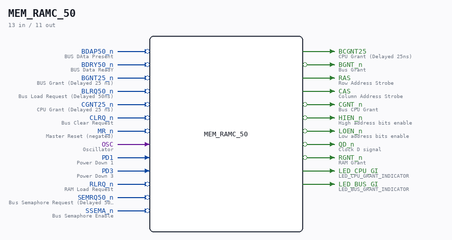

# MEM_RAMC_50

Source: `/mnt/e/Dev/Repos/Ronny/nd-120/Verilog/CPU-BOARD-3202/circuit/MEM_RAMC_50.v`

> Generated by `Verilog/tests/module_doc.py` from the `//!`
> comments in the source. Do not edit by hand - edit the RTL comments and regenerate.

## Description

ND120 CPU, MM&M
MEM/RAMC
LOCAL RAM CONTROL
SHEET 50 of 50
Last reviewed: 14-DEC-2024
Ronny Hansen

## Ports

| Direction | Width | Name | Description |
|---|---|---|---|
| input | `1` | `BDAP50_n` *(active low)* | BUS DAta Present |
| input | `1` | `BDRY50_n` *(active low)* | BUS Data ReadY |
| input | `1` | `BGNT25_n` *(active low)* | BUS Grant (Delayed 25 ns) |
| input | `1` | `BLRQ50_n` *(active low)* | Bus Load Request (Delayed 50ns) |
| input | `1` | `CGNT25_n` *(active low)* | CPU Grant (Delayed 25 ns) |
| input | `1` | `CLRQ_n` *(active low)* | Bus Clear Request |
| input | `1` | `MR_n` *(active low)* | Master Reset (negated) |
| input | `1` | `OSC` | Oscillator |
| input | `1` | `PD1` | Power Down 1 |
| input | `1` | `PD3` | Power Down 3 |
| input | `1` | `RLRQ_n` *(active low)* | RAM Load Request |
| input | `1` | `SEMRQ50_n` *(active low)* | Bus Semaphore Request (Delayed 50ns) |
| input | `1` | `SSEMA_n` *(active low)* | Bus Semaphore Enable |
| output | `1` | `BCGNT25` | CPU Grant (Delayed 25ns) |
| output | `1` | `BGNT_n` *(active low)* | Bus Grant |
| output | `1` | `RAS` | Row Address Strobe |
| output | `1` | `CAS` | Column Address Strobe |
| output | `1` | `CGNT_n` *(active low)* | Bus CPU Grant |
| output | `1` | `HIEN_n` *(active low)* | High address bits enable |
| output | `1` | `LOEN_n` *(active low)* | Low address bits enable |
| output | `1` | `QD_n` *(active low)* | Clock D signal |
| output | `1` | `RGNT_n` *(active low)* | RAM Grant |
| output | `1` | `LED_CPU_GI` | LED_CPU_GRANT_INDICATOR |
| output | `1` | `LED_BUS_GI` | LED_BUS_GRANT_INDICATOR |
