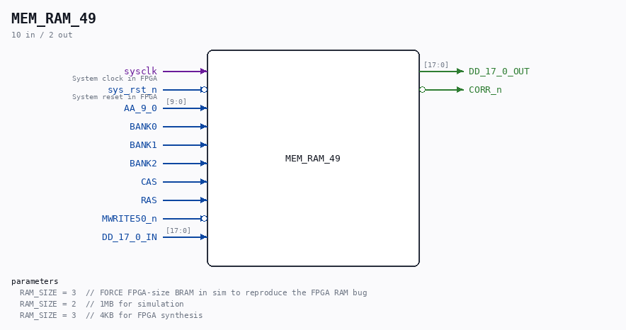

# MEM_RAM_49

Source: `/mnt/e/Dev/Repos/Ronny/nd-120/Verilog/CPU-BOARD-3202/circuit/MEM_RAM_49.v`

> Generated by `Verilog/tests/module_doc.py` from the `//!`
> comments in the source. Do not edit by hand - edit the RTL comments and regenerate.

## Description

ND120 CPU, MM&M
MEM/RAM
LOCAL RAM
SHEET 49 of 50
Last reviewed: 2-FEB-2025
Ronny Hansen

## Parameters

| Parameter | Default |
|---|---|
| `RAM_SIZE` | `3  // FORCE FPGA-size BRAM in sim to reproduce the FPGA RAM bug` |
| `RAM_SIZE` | `2  // 1MB for simulation` |
| `RAM_SIZE` | `3  // 4KB for FPGA synthesis` |

## Ports

| Direction | Width | Name | Description |
|---|---|---|---|
| input | `1` | `sysclk` | System clock in FPGA |
| input | `1` | `sys_rst_n` *(active low)* | System reset in FPGA |
| input | `[9:0]` | `AA_9_0` |  |
| input | `1` | `BANK0` |  |
| input | `1` | `BANK1` |  |
| input | `1` | `BANK2` |  |
| input | `1` | `CAS` |  |
| input | `1` | `RAS` |  |
| input | `1` | `MWRITE50_n` *(active low)* |  |
| input | `[17:0]` | `DD_17_0_IN` |  |
| output | `[17:0]` | `DD_17_0_OUT` |  |
| output | `1` | `CORR_n` *(active low)* |  |
