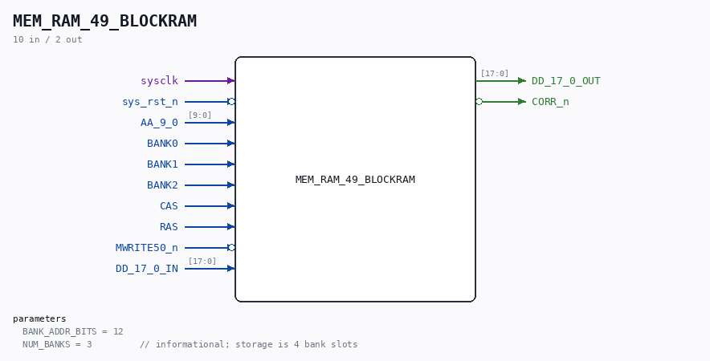

# MEM_RAM_49_BLOCKRAM

Source: `/mnt/e/Dev/Repos/Ronny/nd-120/Verilog/CPU-BOARD-3202/circuit/MEM_RAM_49_BLOCKRAM.v`

> Generated by `Verilog/tests/module_doc.py` from the `//!`
> comments in the source. Do not edit by hand - edit the RTL comments and regenerate.

## Description

ND120 CPU, MM&M
MEM/RAM - block-RAM backend (any FPGA)
Drop-in replacement for the sheet-49 RAM (MEM_RAM_49): one clean
synchronous BRAM instead of six emulated SIP1M9 DRAM chips.
Selected with `define MAIN_RAM_BLOCKRAM (see MEM_43.v).
Implements the MEASURED DRAM protocol (docs/nd120-dram-memory.md
section 4) with the hardware lessons of 8-JUL-2026 baked in:
- row captured at the RAS rising edge (not level)
- write data captured BEFORE CAS (the D bus is driven early and
released around CAS-fall on silicon)
- write executed ONCE, at the first RAS&CAS edge
- registered read, held while CAS is active, bank-gated output
Capacity: NUM_BANKS x 2^BANK_ADDR_BITS 18-bit words. Default 3 banks
x 4K words = 24 KB (Basys3 xc7a35t BRAM budget). Boards with more
BRAM raise BANK_ADDR_BITS. Linear word address = {col, row} like the
proven SIP1M9 FPGA path; the low BANK_ADDR_BITS are used, so keep
test addresses inside a bank to avoid aliasing.
Last reviewed: 8-JUL-2026
Ronny Hansen

## Parameters

| Parameter | Default |
|---|---|
| `BANK_ADDR_BITS` | `12` |
| `NUM_BANKS` | `3         // informational; storage is 4 bank slots` |

## Ports

| Direction | Width | Name | Description |
|---|---|---|---|
| input | `1` | `sysclk` |  |
| input | `1` | `sys_rst_n` *(active low)* |  |
| input | `[9:0]` | `AA_9_0` |  |
| input | `1` | `BANK0` |  |
| input | `1` | `BANK1` |  |
| input | `1` | `BANK2` |  |
| input | `1` | `CAS` |  |
| input | `1` | `RAS` |  |
| input | `1` | `MWRITE50_n` *(active low)* |  |
| input | `[17:0]` | `DD_17_0_IN` |  |
| output | `[17:0]` | `DD_17_0_OUT` |  |
| output | `1` | `CORR_n` *(active low)* |  |
