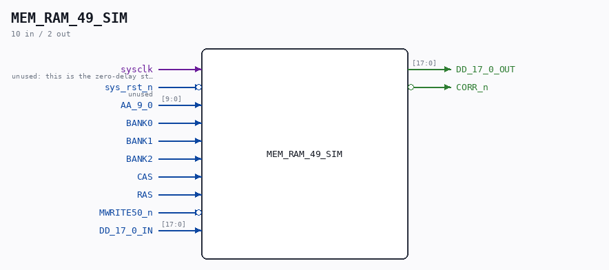

# MEM_RAM_49_SIM

Source: `/mnt/e/Dev/Repos/Ronny/nd-120/Verilog/CPU-BOARD-3202/circuit/MEM_RAM_49_SIM.v`

> Generated by `Verilog/tests/module_doc.py` from the `//!`
> comments in the source. Do not edit by hand - edit the RTL comments and regenerate.

## Description

ND120 CPU, MM&M
MEM/RAM - Verilator simulation backend
Drop-in replacement for the sheet-49 RAM (MEM_RAM_49): the original
zero-delay DRAM model of the six SIP1M9 chips, ported to the shared
sheet-49 interface. Selected automatically for VERILATOR_SIM builds
(see MEM_43.v). Behavior is a faithful port of SIP1M9's ramSize=2
model: row latched on the (bank-gated) RAS edge, memory clocked on
the (bank-gated) CAS edge, output gated by CAS, {row,col} indexing.
Capacity: 3 banks x 1M x 18 bits = 6 MB, same as before.
NOTE for the C++ harnesses (test_nd120.cpp / Run120.cpp /
latch_ff_compare.cpp): programs are preloaded by poking the BANK0
arrays by hierarchical name:
...MEM__DOT__RAM__DOT__b0_lo    [1M x 8]  data bits 7:0
...MEM__DOT__RAM__DOT__b0_lo_p  [1M x 1]  parity bit 8
...MEM__DOT__RAM__DOT__b0_hi    [1M x 8]  data bits 16:9
...MEM__DOT__RAM__DOT__b0_hi_p  [1M x 1]  parity bit 17
(same element widths as the old CHIP_15H/15J sdram/sdram_9 arrays).
ND_SDRAM_PACK16: models the packed-storage memory contract of the
Tang SDRAM backend (docs/nd120-parity-analysis.md section 6) at the
reference level: parity bits are NOT read back from storage - DD[8]/
DD[17] are recomputed from the data on every read (odd parity), so a
deliberately-bad-parity write is absorbed. Capacity/banking and the
C++ preload hooks are unchanged (preload parity arrays become
don't-cares on read). The physical packing/DQM layer itself is
validated by the sdram-bridge tbs and the Tang full-boot vtest.
Last reviewed: 11-JUL-2026
Ronny Hansen

## Ports

| Direction | Width | Name | Description |
|---|---|---|---|
| input | `1` | `sysclk` | unused: this is the zero-delay strobe-clocked model |
| input | `1` | `sys_rst_n` *(active low)* | unused |
| input | `[9:0]` | `AA_9_0` |  |
| input | `1` | `BANK0` |  |
| input | `1` | `BANK1` |  |
| input | `1` | `BANK2` |  |
| input | `1` | `CAS` |  |
| input | `1` | `RAS` |  |
| input | `1` | `MWRITE50_n` *(active low)* |  |
| input | `[17:0]` | `DD_17_0_IN` |  |
| output | `[17:0]` | `DD_17_0_OUT` |  |
| output | `1` | `CORR_n` *(active low)* |  |
