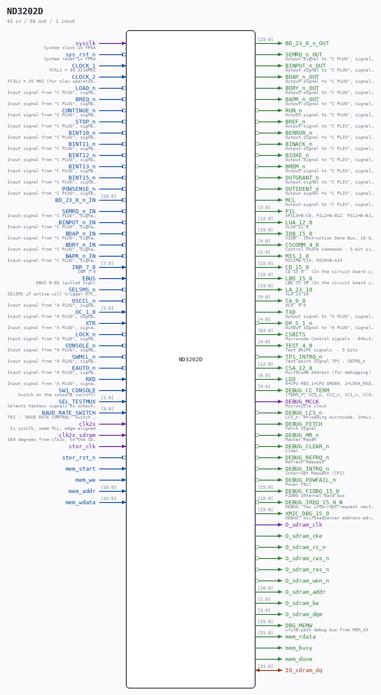

# ND3202D

Source: `/mnt/e/Dev/Repos/Ronny/nd-120/Verilog/CPU-BOARD-3202/circuit/ND3202D.v`

> Generated by `Verilog/tests/module_doc.py` from the `//!`
> comments in the source. Do not edit by hand - edit the RTL comments and regenerate.

## Description

ND120 CPU, MM&M
CPU
CPU TOP LEVEL
SHEET 16 of 50
Last reviewed: 22-MAR-2025
Ronny Hansen

## Ports

| Direction | Width | Name | Description |
|---|---|---|---|
| input | `1` | `sysclk` | System clock in FPGA |
| input | `1` | `sys_rst_n` *(active low)* | System reset in FPGA |
| input | `1` | `CLOCK_1` | XTAL1 = 39.3216MHZ |
| input | `1` | `CLOCK_2` | XTAL2 = 35 MHZ (for slow operations?) |
| input | `1` | `LOAD_n` *(active low)* | Input signal from "C PLUG", signal B12 - LOAD_n |
| input | `1` | `BREQ_n` *(active low)* | Input signal from "C PLUG", signal C12 - BREQ_n (DMA BUS Request) |
| input | `1` | `CONTINUE_n` *(active low)* | Input signal from "C PLUG", signal B15 - CONTINUE_n |
| input | `1` | `STOP_n` *(active low)* | Input signal from "C PLUG", signal B16 - STOP_n |
| input | `1` | `BINT10_n` *(active low)* | Input signal from "C PLUG", signal A15 - BINT10_n |
| input | `1` | `BINT11_n` *(active low)* | Input signal from "C PLUG", signal C15 - BINT11_n |
| input | `1` | `BINT12_n` *(active low)* | Input signal from "C PLUG", signal A16 - BINT12_n |
| input | `1` | `BINT13_n` *(active low)* | Input signal from "C PLUG", signal C16 - BINT13_n |
| input | `1` | `BINT15_n` *(active low)* | Input signal from "C PLUG", signal C17 - BINT15_n |
| input | `1` | `POWSENSE_n` *(active low)* | Input signal from "C PLUG", signals A29,B29,C29 - POWSENSE_n (Power sense signal from the PSU?) |
| input | `[23:0]` | `BD_23_0_n_IN` |  |
| output | `[23:0]` | `BD_23_0_n_OUT` |  |
| input | `1` | `SEMRQ_n_IN` | Input-signal from "C PLUG", signal A17 SEMREQ~ (SEMaphore REQest) |
| output | `1` | `SEMRQ_n_OUT` | Output-signal to "C PLUG", signal A17 SEMREQ~ (SEMaphore REQest) |
| input | `1` | `BINPUT_n_IN` | Input-signal from "C PLUG", signal A18 BINPUT~ (Bus INPUT) |
| output | `1` | `BINPUT_n_OUT` | Output-signal to "C PLUG", signal A18 BINPUT~ (Bus INPUT) |
| input | `1` | `BDAP_n_IN` | Input-signal from "C PLUG", signal C18 BDAP~ (Bus DAta Present) |
| output | `1` | `BDAP_n_OUT` | Output-signal to "C PLUG", signal C18 BDAP~ (Bus DAta Present) |
| input | `1` | `BDRY_n_IN` | Input-signal from "C PLUG", signal A19 BDRY~ (Bus Data ReadY) |
| output | `1` | `BDRY_n_OUT` | Output-signal to "C PLUG", signal A19 BDRY~ (Bus Data ReadY) |
| input | `1` | `BAPR_n_IN` | Input-signal from "C PLUG", signal A20 BAPR~ (Bus Address PResent) |
| output | `1` | `BAPR_n_OUT` | Output-signal to "C PLUG", signal A20 BAPR~ (Bus Address PResent) |
| output | `1` | `RUN_n` *(active low)* | Output-signal to "C PLUG", signal B14 RUN~ (driven by Stop flip-flop: low while CPU is running) |
| output | `1` | `BREF_n` *(active low)* | Output-signal to "C PLIG", signal B12 BREF~ |
| output | `1` | `BERROR_n` *(active low)* | Output-signal to "C PLIG", signal B21 BERROR~ |
| output | `1` | `BINACK_n` *(active low)* | Output-signal to "C PLIG", signal B19 BINACK~ |
| output | `1` | `BIOXE_n` *(active low)* | Output-signal to "C PLIG", signal C19 BIOXE~ |
| output | `1` | `BMEM_n` *(active low)* | Output-signal to "C PLIG", signal C28 BMEM~ |
| output | `1` | `OUTGRANT_n` *(active low)* | Output-signal to "C PLIG", signal C23 OUTGRANT~ (After BREQ request) |
| output | `1` | `OUTIDENT_n` *(active low)* | Output-signal to "C PLIG", signal C22 OUTIDENT~ |
| output | `1` | `MCL` | Output-signal to "C PLIG", signal B20 MCL~ (after negation) |
| input | `[7:0]` | `INR_7_0` | INR 7:0 |
| input | `1` | `EBUS` | EBUS B-B3 (pulled high) |
| input | `1` | `SEL5MS_n` *(active low)* | SEL5MS if active will trigger RTC after 5 ms, not 20ms) |
| output | `[3:0]` | `PIL` | XPIL3=B-C8, PIL2=B-B12. PIL1=B-B10, PIL0=B-B9 |
| output | `[12:0]` | `LUA_12_0` | XLUA 12:0 |
| output | `[15:0]` | `IDB_15_0` | XIDB - Instruction Data Bus, 16-bit bidirectional bus used for transferring instructions and data between CPU components |
| output | `[4:0]` | `CSCOMM_4_0` | Control Store Commands - 5-bit signal carrying microcode command bits to control CPU operations |
| output | `[1:0]` | `MIS_1_0` | MIS1=B-C14, MIS0=B-A14 |
| output | `[15:0]` | `CD_15_0` | CD 15:0   (In the circuit board you strap so that the output to the XIDB15-0 signal is either IDB or LBD) See page 3 in the 3202D schematic) |
| output | `[15:0]` | `LBD_15_0` | LBD 15:10 (In the circuit board you strap so that the output to the XIDB15-0 signal is either IDB or LBD) See page 3 in the 3202D schematic) |
| output | `[13:0]` | `LA_23_10` | XLA 23:10 |
| output | `[9:0]` | `CA_9_0` | XCA  9:0 |
| input | `1` | `OSCCL_n` *(active low)* | Input signal from "A PLUG", signal B3 - OSCCL_n                => (TO IO OSCCL_n) |
| input | `[1:0]` | `OC_1_0` | Input signal from "A PLUG", signal C6 (OC0) and A6 (OC1)       => (TO IO OC_1_0) |
| input | `1` | `XTR` | Input signal from "A PLUG", signal B4/C23 - XTR                => (TO IO XTR) |
| input | `1` | `LOCK_n` *(active low)* | Input signal from "A PLUG", signal B12 - LOCK_n |
| input | `1` | `CONSOLE_n` *(active low)* | Input signal from "A PLUG", signal C21/C30 - CONSOLE_n |
| input | `1` | `SWMCL_n` *(active low)* | Input signal from "A PLUG", signal C16 - SWMCL_n (Switch SW3 on the PCB 3202D might lock this to GND?) |
| input | `1` | `EAUTO_n` *(active low)* | Input signal from "A PLUG", signal C19 - EAUTO_n |
| input | `1` | `RXD` | Input signal from "A PLUG", signal C8 - RXD (to the UART RXD) |
| input | `1` | `SW1_CONSOLE` | Switch on the console (on/off) |
| input | `[2:0]` | `SEL_TESTMUX` | Selects testmux signals to output on TEST_4_0 |
| input | `[3:0]` | `BAUD_RATE_SWITCH` | TH2 - 'BAUD RATE CONTROL' Switch on the PCB to select baudrate |
| output | `1` | `TXD` | Output signal to "A PLUG", signal A10 (D2N) and C7 (TXD) (from the UART TXD) |
| output | `[4:0]` | `DP_5_1_n` *(active low)* | Output signal to "A PLUG", signal DP~5_1 "Display signals" (C25,C26, C27, C28, C29) |
| output | `[63:0]` | `CSBITS` | Microcode Control signals - 64bit (for debugging) |
| output | `[4:0]` | `TEST_4_0` | Test point signals  - 5 bits |
| output | `1` | `TP1_INTRQ_n` *(active low)* | Test point signal TP1 - INTRQ_n |
| output | `[12:0]` | `CSA_12_0` | Microcode Address (for debugging) |
| output | `[6:0]` | `LED` | 0=CPU RED,1=CPU GREEN, 2=LED4_RED_PARITY_ERROR, 3=LED_CPU_GRANT_INDICATOR, 4=LED_BUS_GRANT_INDICATOR, 5=LED1 from MMU 6=LED5_RED_DISABLE_PARITY |
| output | `[4:0]` | `DEBUG_CC_TERM` | {TERM_n, CC3_n, CC2_n, CC1_n, CC0_n} |
| output | `1` | `DEBUG_MCLK` | Microcycle clock |
| output | `1` | `DEBUG_LCS_n` *(active low)* | LCS_n: 0=loading microcode, 1=microcode loaded |
| output | `1` | `DEBUG_FETCH` | Fetch signal |
| output | `1` | `DEBUG_MR_n` *(active low)* | Master Reset |
| output | `1` | `DEBUG_CLEAR_n` *(active low)* | Clear |
| output | `1` | `DEBUG_REFRQ_n` *(active low)* | Refresh Request |
| output | `1` | `DEBUG_INTRQ_n` *(active low)* | Interrupt Request (TP1) |
| output | `1` | `DEBUG_POWFAIL_n` *(active low)* | Power Fail |
| output | `[15:0]` | `DEBUG_FIDBO_15_0` | FIDBO internal data bus |
| output | `[15:0]` | `DEBUG_IREQ_15_0_N` *(active low)* | DEBUG: raw interrupt-request vector (active low) |
| output | `[15:0]` | `XMIC_DBG_15_0` | DEBUG: microsequencer address-advance probe (Tang 06000-hang) |
| input | `1` | `clk2x` | 2x sysclk, same PLL, edge-aligned |
| input | `1` | `clk2x_sdram` | 180 degrees from clk2x, to the SDRAM chip |
| output | `1` | `O_sdram_clk` |  |
| output | `1` | `O_sdram_cke` |  |
| output | `1` | `O_sdram_cs_n` *(active low)* |  |
| output | `1` | `O_sdram_cas_n` *(active low)* |  |
| output | `1` | `O_sdram_ras_n` *(active low)* |  |
| output | `1` | `O_sdram_wen_n` *(active low)* |  |
| inout | `[31:0]` | `IO_sdram_dq` |  |
| output | `[10:0]` | `O_sdram_addr` |  |
| output | `[1:0]` | `O_sdram_ba` |  |
| output | `[3:0]` | `O_sdram_dqm` |  |
| output | `[15:0]` | `DBG_MEMW` | write-path debug bus from MEM_43 |
| input | `1` | `stor_clk` |  |
| input | `1` | `stor_rst_n` *(active low)* |  |
| input | `1` | `mem_start` |  |
| input | `1` | `mem_we` |  |
| input | `[19:0]` | `mem_addr` |  |
| input | `[31:0]` | `mem_wdata` |  |
| output | `[31:0]` | `mem_rdata` |  |
| output | `1` | `mem_busy` |  |
| output | `1` | `mem_done` |  |
