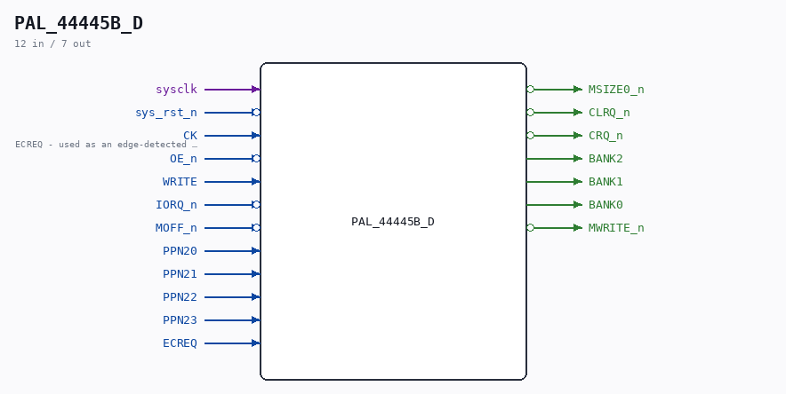

# PAL_44445B_D

Source: `/mnt/e/Dev/Repos/Ronny/nd-120/Verilog/CPU-BOARD-3202/circuit/PAL_44445B_D.v`

> Generated by `Verilog/tests/module_doc.py` from the `//!`
> comments in the source. Do not edit by hand - edit the RTL comments and regenerate.

## Description

PAL_44445B_D - sysclk-domain mirror of PAL_44445B (UCADEC)
Same equations; registers sample on sysclk with a rising-edge ENABLE
on the original CK (ECREQ) instead of using it as a clock net.
PAL file itself untouched. Pattern: CYC_CC_D / CYC_TERM_D.
Last reviewed: 8-JUL-2026  Ronny Hansen

## Ports

| Direction | Width | Name | Description |
|---|---|---|---|
| input | `1` | `sysclk` |  |
| input | `1` | `sys_rst_n` *(active low)* |  |
| input | `1` | `CK` | ECREQ - used as an edge-detected ENABLE here |
| input | `1` | `OE_n` *(active low)* |  |
| input | `1` | `WRITE` |  |
| input | `1` | `IORQ_n` *(active low)* |  |
| input | `1` | `MOFF_n` *(active low)* |  |
| input | `1` | `PPN20` |  |
| input | `1` | `PPN21` |  |
| input | `1` | `PPN22` |  |
| input | `1` | `PPN23` |  |
| output | `1` | `MSIZE0_n` *(active low)* |  |
| output | `1` | `CLRQ_n` *(active low)* |  |
| output | `1` | `CRQ_n` *(active low)* |  |
| input | `1` | `ECREQ` |  |
| output | `1` | `BANK2` |  |
| output | `1` | `BANK1` |  |
| output | `1` | `BANK0` |  |
| output | `1` | `MWRITE_n` *(active low)* |  |
