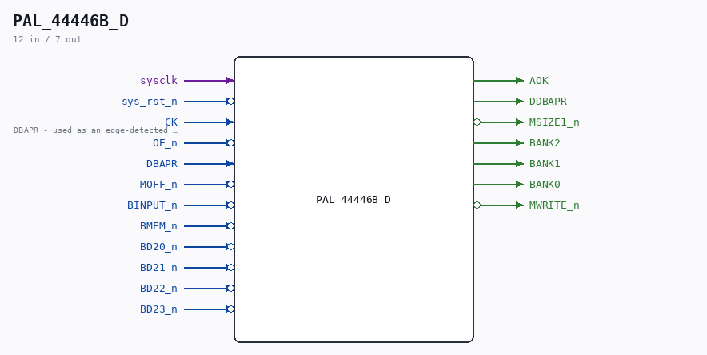

# PAL_44446B_D

Source: `/mnt/e/Dev/Repos/Ronny/nd-120/Verilog/CPU-BOARD-3202/circuit/PAL_44446B_D.v`

> Generated by `Verilog/tests/module_doc.py` from the `//!`
> comments in the source. Do not edit by hand - edit the RTL comments and regenerate.

## Description

PAL_44446B_D - sysclk-domain mirror of PAL_44446B (UBADEC)
Same equations; the four registers sample on sysclk with a rising-
edge ENABLE on the original CK (DBAPR) instead of using it as a
clock net (routed-net-as-clock breaks the write phase on FPGA -
see docs/HANDOFF-basys3-memory-write.md). PAL file itself untouched.
Pattern: CYC_CC_D / CYC_TERM_D.
Last reviewed: 8-JUL-2026  Ronny Hansen

## Ports

| Direction | Width | Name | Description |
|---|---|---|---|
| input | `1` | `sysclk` |  |
| input | `1` | `sys_rst_n` *(active low)* |  |
| input | `1` | `CK` | DBAPR - used as an edge-detected ENABLE here |
| input | `1` | `OE_n` *(active low)* |  |
| input | `1` | `DBAPR` |  |
| input | `1` | `MOFF_n` *(active low)* |  |
| input | `1` | `BINPUT_n` *(active low)* |  |
| input | `1` | `BMEM_n` *(active low)* |  |
| input | `1` | `BD20_n` *(active low)* |  |
| input | `1` | `BD21_n` *(active low)* |  |
| input | `1` | `BD22_n` *(active low)* |  |
| input | `1` | `BD23_n` *(active low)* |  |
| output | `1` | `AOK` |  |
| output | `1` | `DDBAPR` |  |
| output | `1` | `MSIZE1_n` *(active low)* |  |
| output | `1` | `BANK2` |  |
| output | `1` | `BANK1` |  |
| output | `1` | `BANK0` |  |
| output | `1` | `MWRITE_n` *(active low)* |  |
