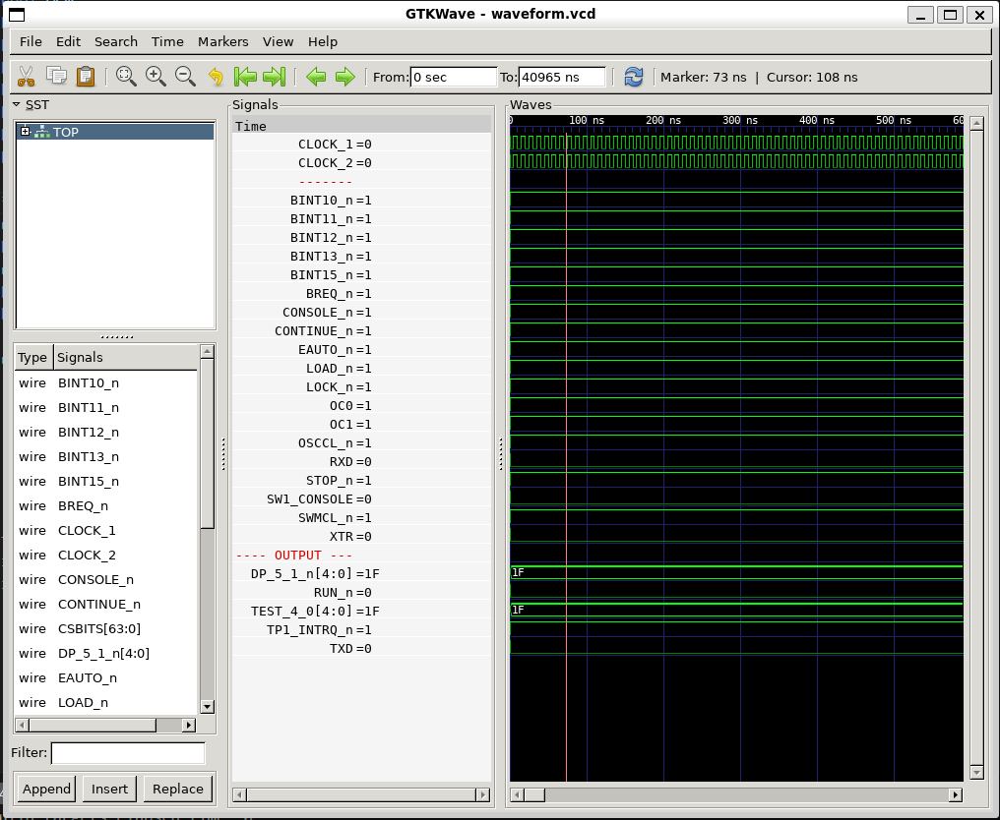

# Verilog code for CPU BOARD 3202D

## Status of Verilog code for 3202D pr sheet ##

| Page name         |                       | Sheet number       | Area        | QA  | Status                                          | Comment                                                                 |
|-------------------|-----------------------|--------------------|-------------|-----|-------------------------------------------------|-------------------------------------------------------------------------|
| **Main PCB**                              |
| DELILAH TOP LEVEL | BLOCK DIAGRAM         | 1                  | D3202       |     | [Verilog created](circuit/TOP_3202D.v)          | [Test](circuit/TOP_3202D/readme.md)
| DELILAH TOP LEVEL | A PLUG                | 2                  | D3202       |     |
| DELILAH TOP LEVEL | B PLUG                | 3                  | D3202       |     |
| DELILAH TOP LEVEL | C PLUG                | 4                  | D3202       |     |
| **Bus interface**
| BIF               | BUS IF                | 5                  | BIF         |     | [Verilog created](circuit/BIF_5.v)              | (test not created yet)
| BIF/BCTL          | BIF CONTROL           | 6                  | BIF         |     | [Verilog created](circuit/BIF_BCTL_6.v)         | (test not created yet)
| BIF/BCTL/BDRV     | BUS DRIVERS           | 7                  | BIF         |     | [Verilog created](circuit/BIF_BCTL_BDRV_7.v)    | (test not created yet)
| BIF/DPATH         | BIF SYNC              | 8                  | BIF         |     | [Verilog created](circuit/BIF_BCTL_SYNC_8.v)    | (test not created yet)
| BIF DATA PATH     | BIF SYNC              | 9                  | BIF         |     | [Verilog created](circuit/BIF_DPATH_9.v)        | (test not created yet)
| BIF/DPATH/BDLBD   | BIF BD TO LBD         | 10                 | BIF         |     | [Verilog created](circuit/BIF_DPATH_BDLBD_10.v) | (test not created yet)
| BIF/DPATH/CDLBD   | BIF CD TO LBD         | 11                 | BIF         |     | [Verilog created](circuit/BIF_DPATH_CDLBD_11.v) | (test not created yet)
| BIF/DPATH/LBCTL   | LBD CONTROL           | 12                 | BIF         |     | [Verilog created](circuit/BIF_DPATH_LDBCTL_12.v)| (test not created yet)
| BIF/DPATH/PESPEA  | BIF PES & PEA         | 13                 | BIF         |     | [Verilog created](circuit/BIF_DPATH_PESPEA_13.v)| (test not created yet)
| BIF/DPATH/PPNLBD  | BIF PPN to LBD        | 14                 | BIF         |     | [Verilog created](circuit/BIF_DPATH_PPNLBD_14.v)| (test not created yet)
| **CPU**                                                                      |     |
| CPU               | TOP LEVEL             | 15                 | CPU         |     | [Verilog created](circuit/CPU_15.v)             | [Test](circuit/CPU_15/readme.md)
| CPU/CS            | CONTROL STORE         | 16                 | CPU         |     | [Verilog created](circuit/CPU_CS_16.v)          | [Test](circuit/CPU_CS_16/readme.md)
| CPU/CS/ACAL       | MICRO ADDR CALC       | 17                 | CPU         |     | [Verilog created](circuit/CPU_CS_ACAL_17.v)     | [Test](circuit/CPU_CS_ACAL_17/readme.md)
| CPU/CS/CTL        | CS CONTROL            | 18                 | CPU         |     | [Verilog created](circuit/CPU_CS_CTL_18.v)      | [Test](circuit/CPU_CS_CTL_18/readme.md)
| CPU/CS/PROM       | CS PROMS              | 19                 | CPU         |     | [Verilog created](circuit/CPU_CS_PROM_19.v)     | [Test](circuit/CPU_CS_PROM_19/readme.md)
| CPU/CS/TCV        | CS TRANSCIEVERS       | 20                 | CPU         |     | [Verilog created](circuit/CPU_CS_TCV_20.v)      | [Test](circuit/CPU_CS_TCV_20/readme.md)
| CPU/CS/WCS        | Register file         | 21-22              | CPU         |     | [Verilog created](circuit/CPU_CS_WCS_21_22.v)   | [Test](circuit/CPU_CS_WCS_21_22/readme.md)
| CPU/LAPA          | LA TO PPN BUFF        | 23                 | CPU         | --- | REMOVED. One line of code in CPU_15.v           ||
| CPU/MMU           | MMU TOP LEVEL         | 24                 | CPU         |     | [Verilog created](circuit/CPU_MMU_24.v)         | (test not created yet)
| CPU/MMU/CACHE     | CACHE                 | 25                 | CPU         |     | [Verilog created](circuit/CPU_MMU_CACHE_25.v)   | (test not created yet)
| CPU/MMU/CSR       | CACHE STATUS REG      | 26                 | CPU         |     | [Verilog created](circuit/CPU_MMU_CSR_26.v)     | [Test](circuit/CPU_MMU_CSR_26/readme.md)
| CPU/MMU/HIT       | HIT DETECTION         | 27                 | CPU         |     | 
| CPU/MMU/PPNX      | PPN TO IDB            | 28                 | CPU         |     | [Verilog created](circuit/CPU_MMU_PPNX_28.v)    | [Test](circuit/CPU_MMU_PPNX_28/readme.md)
| CPU/MMU/PT        | PAGE TABLES           | 29                 | CPU         |     | [Verilog created](circuit/CPU_MMU_PT_29.v)      | [Test](circuit/CPU_MMU_PT_29/readme.md) (More test!!)
| CPU/MMU/PTIDB     | PT TO IDB             | 30                 | CPU         |     | [Verilog created](circuit/CPU_MMU_PTIDB_30.v)   | [Test](circuit/CPU_MMU_PTIDB_30/readme.md) (Bidirectional bus not working correctly in Verilator, maybe in FPGA?)
| CPU/MMU/WCA       | PPN TO CPN            | 31                 | CPU         |     | [Verilog created](circuit/CPU_MMU_WCA_31.v)     | [Test](circuit/CPU_MMU_WCA_31/readme.md)
| CPU/PROC          | PROCESSOR TOP LEVEL   | 32                 | CPU         |     | [Verilog created](circuit/CPU_PROC_32.v)        | [Test](circuit/CPU_PROC_32/readme.md)
| CPU/PROC/CGA      | CPU GATE ARRAY        | 33                 | CPU         |     | [Verilog created](circuit/CPU_PROC_CGA_33.v)    | [Test](circuit/CPU_PROC_CGA_33/readme.md)
| CPU/PROC/CMDDEC   | COMMANDS & IDB DECODE | 34                 | CPU         |     | [Verilog created](circuit/CPU_PROC_CMDDEC_34.v) | [Test](circuit/CPU_PROC_CMDDEC_34/readme.md)
| CPU/STOC          | IDB TO CD             | 35                 | CPU         |     | REMOVED. One line of code in CPU_15.v           ||
| **Cycle control** |                       |                    |             |     |                                                 ||
| CYC               | CYCLE CONTROL         | 36                 | CYC         | YES | [Verilog created](circuit/CYC_36.v)             | [Test](circuit/CYC_36/readme.md)
| **IO**
| IO                | IO TOP LEVEL          | 37                 | IO          |     | [Verilog created](circuit/IO_37.v)              | [Test](circuit/IO_37/readme.md)  - Need more test!
| IO/DCD            | IO DECODING           | 38                 | IO          |     | [Verilog created](circuit/IO_DCD_38.v)          | [Test](circuit/IO_DCD_38/readme.md) - Connected DGA. Need more test! 
| IO/DCD/DGA        | DECODE GATE ARRAY     | 39                 | IO          |     | Directly integrated in Sheet 38                 | Sheet 39 has no code.
| IO/PANCAL         | PANEL PROC & CALENDAR | 40                 | IO          |     | [Verilog created](circuit/IO_PANCAL_40.v)       | (test not created)
| IO/REG            | IOC, ALD & INR REGS   | 41                 | IO          | YES | [Verilog created](circuit/IO_REG_41.v)          | [Test](circuit/IO_REG_41/readme.md)
| IO/UART           | UART AND IOR REG      | 42                 | IO          | YES | [Verilog created](circuit/IO_UART_42.v)         | [Test](circuit/IO_UART_42/readme.md)
| **Memory**                                                                     
| MEM               | MEMORY TOP LEVEL      | 43                 | MEM         |     |
| MEM/ADDR          | MEM ADDR MUX          | 44                 | MEM         |     |
| MEM/ADEC          | ADDRESS DECODER       | 45                 | MEM         |     |
| MEM/DATA          | DATA & PARITY TCV     | 46                 | MEM         |     |
| MEM/ERROR         | LOCAL PES & PEA       | 47                 | MEM         |     |
| MEM/LBDIF         | LOCAL BD CONTROL      | 48                 | MEM         |     |
| MEM/RAM           | LOCAL RAM             | 49                 | MEM         |     |
| MEM/RAMC          | LOCAL RAM CONTROL     | 50                 | MEM         |     |
                                                                               
# Test program verification

