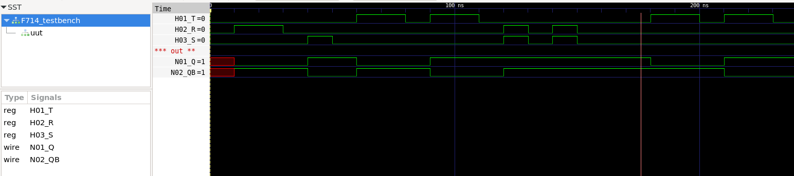

# Verilog verification of F714 (Toggle Flip-Flop)

NEC F714 - T Flip-Flop with R, S

## Test program verification

* Initialize inputs
* Test reset condition
* Test set condition
* Test toggle condition #1
* Test toggle condition #2
* Test prohibition condition
* Test moving from prohibition to toggle
* Test toggle condition #3
* Test toggle condition #4

## TRUTH TABLE

| T       | R | S | Q      | QB   |                      |
|---------|---|---|--------|------|----------------------|
| posedge | 0 | 0 | Invert |      |
| negedge | 0 | 0 | Hold   |      |
|   X     | 1 | 0 | 0      | 1    |
|   X     | 0 | 1 | 1      | 0    |
|   X     | 1 | 1 | 1      | 1    |  <= prohibition

*X=irrelevant*

