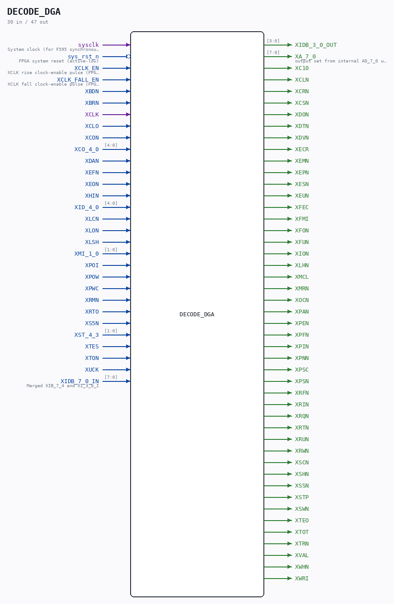

# DECODE_DGA

Source: `/mnt/e/Dev/Repos/Ronny/nd-120/Verilog/DECODE-GateArray/DGA/circuit/DECODE_DGA.v`

> Generated by `Verilog/tests/module_doc.py` from the `//!`
> comments in the source. Do not edit by hand - edit the RTL comments and regenerate.

## Description

ND120 DGA (Decode Gate Array)
DECODE/DGA
PDF Page 2 -> DECODE - DECODE_DGA- Sheet 1 of 6
PDF Page 3 -> DECODE - DECODE_DGA- Sheet 2 of 6
PDF Page 4 -> DECODE - DECODE_DGA- Sheet 3 of 6
PDF Page 5 -> DECODE - DECODE_DGA- Sheet 4 of 6
PDF Page 6 -> DECODE - DECODE_DGA- Sheet 5 of 6
PDF Page 7 -> DECODE - DECODE_DGA- Sheet 6 of 6
Last reviewed: 22-MAR-2025
Ronny Hansen

## Ports

| Direction | Width | Name | Description |
|---|---|---|---|
| input | `1` | `sysclk` | System clock (for F595 synchronous RS latch) |
| input | `1` | `sys_rst_n` *(active low)* | FPGA system reset (active-low) |
| input | `1` | `XCLK_EN` | XCLK rise clock-enable pulse (FPGA_FF_MODE, else 0) |
| input | `1` | `XCLK_FALL_EN` | XCLK fall clock-enable pulse (FPGA_FF_MODE, else 0) |
| input | `1` | `XBDN` |  |
| input | `1` | `XBRN` |  |
| input | `1` | `XCLK` |  |
| input | `1` | `XCLO` |  |
| input | `1` | `XCON` |  |
| input | `[4:0]` | `XCO_4_0` |  |
| input | `1` | `XDAN` |  |
| input | `1` | `XEFN` |  |
| input | `1` | `XEON` |  |
| input | `1` | `XHIN` |  |
| input | `[4:0]` | `XID_4_0` |  |
| input | `1` | `XLCN` |  |
| input | `1` | `XLON` |  |
| input | `1` | `XLSH` |  |
| input | `[1:0]` | `XMI_1_0` |  |
| input | `1` | `XPOI` |  |
| input | `1` | `XPOW` |  |
| input | `1` | `XPWC` |  |
| input | `1` | `XRMN` |  |
| input | `1` | `XRTO` |  |
| input | `1` | `XS5N` |  |
| input | `[1:0]` | `XST_4_3` |  |
| input | `1` | `XTES` |  |
| input | `1` | `XTON` |  |
| input | `1` | `XUCK` |  |
| input | `[7:0]` | `XIDB_7_0_IN` | Merged XIB_7_4 and XI_3_0_I |
| output | `[3:0]` | `XIDB_3_0_OUT` |  |
| output | `[7:0]` | `XA_7_0` | output set from internal AD_7_0 when RMM_n is low(external signal XRMN) |
| output | `1` | `XC10` |  |
| output | `1` | `XCLN` |  |
| output | `1` | `XCRN` |  |
| output | `1` | `XCSN` |  |
| output | `1` | `XDON` |  |
| output | `1` | `XDTN` |  |
| output | `1` | `XDVN` |  |
| output | `1` | `XECR` |  |
| output | `1` | `XEMN` |  |
| output | `1` | `XEPN` |  |
| output | `1` | `XESN` |  |
| output | `1` | `XEUN` |  |
| output | `1` | `XFEC` |  |
| output | `1` | `XFMI` |  |
| output | `1` | `XFON` |  |
| output | `1` | `XFUN` |  |
| output | `1` | `XION` |  |
| output | `1` | `XLHN` |  |
| output | `1` | `XMCL` |  |
| output | `1` | `XMRN` |  |
| output | `1` | `XOCN` |  |
| output | `1` | `XPAN` |  |
| output | `1` | `XPEN` |  |
| output | `1` | `XPFN` |  |
| output | `1` | `XPIN` |  |
| output | `1` | `XPNN` |  |
| output | `1` | `XPSC` |  |
| output | `1` | `XPSN` |  |
| output | `1` | `XRFN` |  |
| output | `1` | `XRIN` |  |
| output | `1` | `XRQN` |  |
| output | `1` | `XRTN` |  |
| output | `1` | `XRUN` |  |
| output | `1` | `XRWN` |  |
| output | `1` | `XSCN` |  |
| output | `1` | `XSHN` |  |
| output | `1` | `XSSN` |  |
| output | `1` | `XSTP` |  |
| output | `1` | `XSWN` |  |
| output | `1` | `XTEO` |  |
| output | `1` | `XTOT` |  |
| output | `1` | `XTRN` |  |
| output | `1` | `XVAL` |  |
| output | `1` | `XWHN` |  |
| output | `1` | `XWRI` |  |
