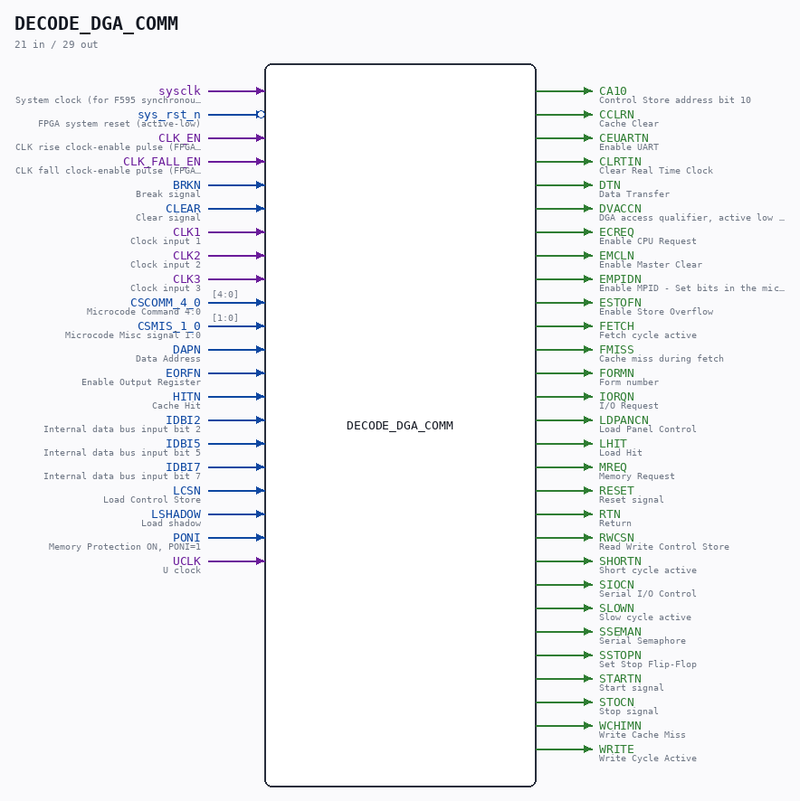

# DECODE_DGA_COMM

Source: `/mnt/e/Dev/Repos/Ronny/nd-120/Verilog/DECODE-GateArray/DGA/circuit/DECODE_DGA_COMM.v`

> Generated by `Verilog/tests/module_doc.py` from the `//!`
> comments in the source. Do not edit by hand - edit the RTL comments and regenerate.

## Description

ND120 DGA (Decode Gate Array)
DGA (Decode Gate Array)
Decode Internal Databus Commands
Page 16 DECODE - DECODE_DGA_COMM - Sheet 1 of 4
Page 17 DECODE - DECODE_DGA_COMM - Sheet 2 of 4
Page 18 DECODE - DECODE_DGA_COMM - Sheet 3 of 4
Page 19 DECODE - DECODE_DGA_COMM - Sheet 4 of 4
Last reviewed: 2-FEB-2025
Ronny Hansen

## Ports

| Direction | Width | Name | Description |
|---|---|---|---|
| input | `1` | `sysclk` | System clock (for F595 synchronous RS latch) |
| input | `1` | `sys_rst_n` *(active low)* | FPGA system reset (active-low) |
| input | `1` | `CLK_EN` | CLK rise clock-enable pulse (FPGA_FF_MODE, else 0) |
| input | `1` | `CLK_FALL_EN` | CLK fall clock-enable pulse (FPGA_FF_MODE, else 0) |
| input | `1` | `BRKN` | Break signal |
| input | `1` | `CLEAR` | Clear signal |
| input | `1` | `CLK1` | Clock input 1 |
| input | `1` | `CLK2` | Clock input 2 |
| input | `1` | `CLK3` | Clock input 3 |
| input | `[4:0]` | `CSCOMM_4_0` | Microcode Command 4:0 |
| input | `[1:0]` | `CSMIS_1_0` | Microcode Misc signal 1:0 |
| input | `1` | `DAPN` | Data Address |
| input | `1` | `EORFN` | Enable Output Register |
| input | `1` | `HITN` | Cache Hit |
| input | `1` | `IDBI2` | Internal data bus input bit 2 |
| input | `1` | `IDBI5` | Internal data bus input bit 5 |
| input | `1` | `IDBI7` | Internal data bus input bit 7 |
| input | `1` | `LCSN` | Load Control Store |
| input | `1` | `LSHADOW` | Load shadow |
| input | `1` | `PONI` | Memory Protection ON, PONI=1 |
| input | `1` | `UCLK` | U clock |
| output | `1` | `CA10` | Control Store address bit 10 |
| output | `1` | `CCLRN` | Cache Clear |
| output | `1` | `CEUARTN` | Enable UART |
| output | `1` | `CLRTIN` | Clear Real Time Clock |
| output | `1` | `DTN` | Data Transfer |
| output | `1` | `DVACCN` | DGA access qualifier, active low (see comment above) |
| output | `1` | `ECREQ` | Enable CPU Request |
| output | `1` | `EMCLN` | Enable Master Clear |
| output | `1` | `EMPIDN` | Enable MPID - Set bits in the micro—PID (Priority Interrupt Detect) register in the PIC. Command #012. "set mask reg: inh all ints" |
| output | `1` | `ESTOFN` | Enable Store Overflow |
| output | `1` | `FETCH` | Fetch cycle active |
| output | `1` | `FMISS` | Cache miss during fetch |
| output | `1` | `FORMN` | Form number |
| output | `1` | `IORQN` | I/O Request |
| output | `1` | `LDPANCN` | Load Panel Control |
| output | `1` | `LHIT` | Load Hit |
| output | `1` | `MREQ` | Memory Request |
| output | `1` | `RESET` | Reset signal |
| output | `1` | `RTN` | Return |
| output | `1` | `RWCSN` | Read Write Control Store |
| output | `1` | `SHORTN` | Short cycle active |
| output | `1` | `SIOCN` | Serial I/O Control |
| output | `1` | `SLOWN` | Slow cycle active |
| output | `1` | `SSEMAN` | Serial Semaphore |
| output | `1` | `SSTOPN` | Set Stop Flip-Flop |
| output | `1` | `STARTN` | Start signal |
| output | `1` | `STOCN` | Stop signal |
| output | `1` | `WCHIMN` | Write Cache Miss |
| output | `1` | `WRITE` | Write Cycle Active |
