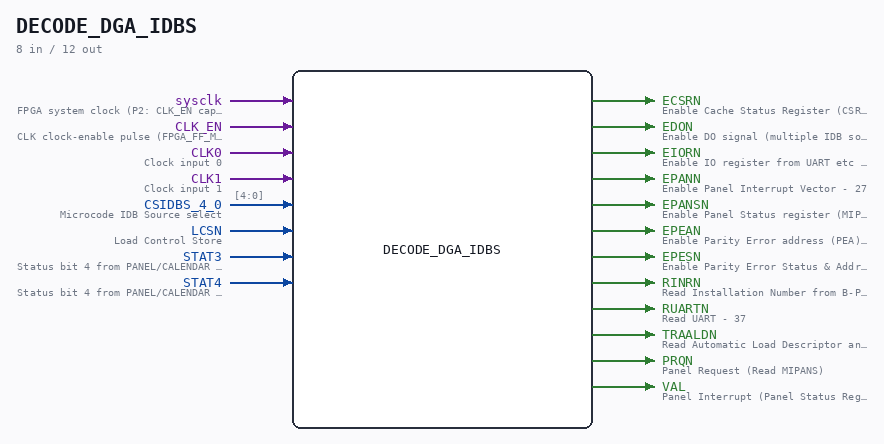

# DECODE_DGA_IDBS

Source: `/mnt/e/Dev/Repos/Ronny/nd-120/Verilog/DECODE-GateArray/DGA/circuit/DECODE_DGA_IDBS.v`

> Generated by `Verilog/tests/module_doc.py` from the `//!`
> comments in the source. Do not edit by hand - edit the RTL comments and regenerate.

## Description

ND120 DGA (Decode Gate Array)
DECODE/DGA/IDBS
Decode Internal Databus SOURCE (IDBS). Generates ENABLE signals for
the chips to be read or written
Page 14 DECODE - DECODE_DGA_IDBS Sheet 1 of 2
Page 15 DECODE - DECODE_DGA_IDBS Sheet 2 of 2
Last reviewed: 2-FEB-2025
Ronny Hansen

## Ports

| Direction | Width | Name | Description |
|---|---|---|---|
| input | `1` | `sysclk` | FPGA system clock (P2: CLK_EN capture) |
| input | `1` | `CLK_EN` | CLK clock-enable pulse (FPGA_FF_MODE, else 0) |
| input | `1` | `CLK0` | Clock input 0 |
| input | `1` | `CLK1` | Clock input 1 |
| input | `[4:0]` | `CSIDBS_4_0` | Microcode IDB Source select |
| input | `1` | `LCSN` | Load Control Store |
| input | `1` | `STAT3` | Status bit 4 from PANEL/CALENDAR CPU 68705 |
| input | `1` | `STAT4` | Status bit 4 from PANEL/CALENDAR CPU 68705 |
| output | `1` | `ECSRN` | Enable Cache Status Register (CSR) - 24 |
| output | `1` | `EDON` | Enable DO signal (multiple IDB sources) - 0,1,2,3,4,6,10,11,14,25,36 |
| output | `1` | `EIORN` | Enable IO register from UART etc -16 |
| output | `1` | `EPANN` | Enable Panel Interrupt Vector - 27 |
| output | `1` | `EPANSN` | Enable Panel Status register (MIPANS/MAPANS - 20/21 |
| output | `1` | `EPEAN` | Enable Parity Error address (PEA) - 12 |
| output | `1` | `EPESN` | Enable Parity Error Status & Address (PES) -13 |
| output | `1` | `RINRN` | Read Installation Number from B-PLUG (RINR) - IDBS=35 |
| output | `1` | `RUARTN` | Read UART - 37 |
| output | `1` | `TRAALDN` | Read Automatic Load Descriptor and print-status (ALD) - 26 |
| output | `1` | `PRQN` | Panel Request (Read MIPANS) |
| output | `1` | `VAL` | Panel Interrupt (Panel Status Register bit 12 on read) |
