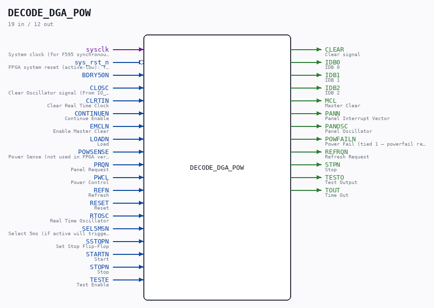

# DECODE_DGA_POW

Source: `/mnt/e/Dev/Repos/Ronny/nd-120/Verilog/DECODE-GateArray/DGA/circuit/DECODE_DGA_POW.v`

> Generated by `Verilog/tests/module_doc.py` from the `//!`
> comments in the source. Do not edit by hand - edit the RTL comments and regenerate.

## Description

ND120 DGA
DECODE/DGA/POW
Page 8 DECODE - DECODE_DGA_POW- Sheet 1 of 3
Page 9 DECODE - DECODE_DGA_POW- Sheet 2 of 3
Page 10 DECODE - DECODE_DGA_POW- Sheet 3 of 3
Last reviewed: 2-FEB-2025
Ronny Hansen
FPGA changes:
- sys_rst_n added: forces all F595 RS latches to idle (Q=0,Qn=1)
during FPGA reset, preventing boot lockup from uninitialized state
- Powerfail logic removed (A596,A602,A593,A594,A591,A605,A600,A601)
Not needed on FPGA — sys_rst_n replaces powerfail-driven reset
- A569 (CLEAR latch) replaced by assign s_clear_n = sys_rst_n
This pulses CLEAR during the FPGA reset window (replaces powerfail
→ CLEAR chain). Releases when sys_rst_n goes high at boot.
- RTC counter replaced with synchronous sysclk counter (A577 was
the original D_FF; A623/A619/A624/A616/A618/A617/A625 chain was
unreliable in FPGA fabric due to cascaded data-signal clocks).
- VERILATOR_SIM: short RTC count (8192/2048 cycles) for fast sim.
Matches original TESTE=1 F714-chain effective period (~8K cycles).
Fast enough for simulation, slow enough for instruction verify.
FPGA: real 20ms/5ms count at 100 MHz.

## Ports

| Direction | Width | Name | Description |
|---|---|---|---|
| input | `1` | `sysclk` | System clock (for F595 synchronous RS latch on FPGA) |
| input | `1` | `sys_rst_n` *(active low)* | FPGA system reset (active-low): forces latches to idle, pulses CLEAR |
| input | `1` | `BDRY50N` |  |
| input | `1` | `CLOSC` | Clear Oscillator signal (From IO_DCD_38) - High briefly at power-on then 0 |
| input | `1` | `CLRTIN` | Clear Real Time Clock |
| input | `1` | `CONTINUEN` | Continue Enable |
| input | `1` | `EMCLN` | Enable Master Clear |
| input | `1` | `LOADN` | Load |
| input | `1` | `POWSENSE` | Power Sense (not used in FPGA version — powerfail removed) |
| input | `1` | `PRQN` | Panel Request |
| input | `1` | `PWCL` | Power Control |
| input | `1` | `REFN` | Refresh |
| input | `1` | `RESET` | Reset |
| input | `1` | `RTOSC` | Real Time Oscillator |
| input | `1` | `SEL5MSN` | Select 5ms (if active will trigger RTC after 5ms, not 20ms) |
| input | `1` | `SSTOPN` | Set Stop Flip-Flop |
| input | `1` | `STARTN` | Start |
| input | `1` | `STOPN` | Stop |
| input | `1` | `TESTE` | Test Enable |
| output | `1` | `CLEAR` | Clear signal |
| output | `1` | `IDB0` | IDB 0 |
| output | `1` | `IDB1` | IDB 1 |
| output | `1` | `IDB2` | IDB 2 |
| output | `1` | `MCL` | Master Clear |
| output | `1` | `PANN` | Panel Interrupt Vector |
| output | `1` | `PANOSC` | Panel Oscillator |
| output | `1` | `POWFAILN` | Power Fail (tied 1 — powerfail removed in FPGA version) |
| output | `1` | `REFRQN` | Refresh Request |
| output | `1` | `STPN` | Stop |
| output | `1` | `TESTO` | Test Output |
| output | `1` | `TOUT` | Time Out |
