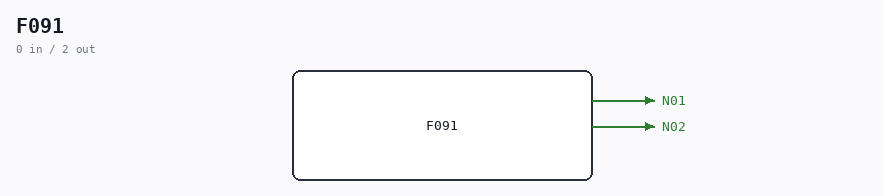

# F091

Source: `/mnt/e/Dev/Repos/Ronny/nd-120/Verilog/DECODE-GateArray/DGA/circuit/F091.v`

> Generated by `Verilog/tests/module_doc.py` from the `//!`
> comments in the source. Do not edit by hand - edit the RTL comments and regenerate.

## Description

ND120 DGA (Decode Gate Array)
DECODE/DGA
NEC F091 -  H,L LEVEL GENERATOR
Last reviewed: 20-MAY-2024
Ronny Hansen

## Ports

| Direction | Width | Name | Description |
|---|---|---|---|
| output | `1` | `N01` |  |
| output | `1` | `N02` |  |
