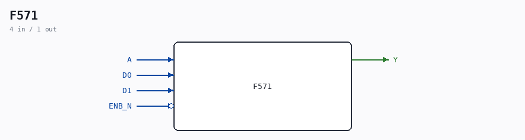

# F571

Source: `/mnt/e/Dev/Repos/Ronny/nd-120/Verilog/DECODE-GateArray/DGA/circuit/F571.v`

> Generated by `Verilog/tests/module_doc.py` from the `//!`
> comments in the source. Do not edit by hand - edit the RTL comments and regenerate.

## Description

ND120 DGA (Decode Gate Array)
DECODE/DGA
NEC F571 - 2 TO 1 MULTIPLEXER
Last reviewed: 20-MAY-2024
Ronny Hansen

## Ports

| Direction | Width | Name | Description |
|---|---|---|---|
| input | `1` | `A` |  |
| input | `1` | `D0` |  |
| input | `1` | `D1` |  |
| input | `1` | `ENB_N` *(active low)* |  |
| output | `1` | `Y` |  |
