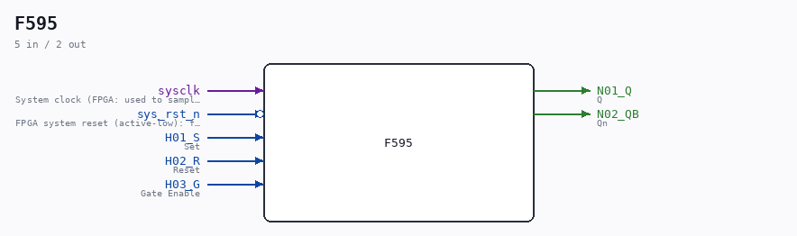

# F595

Source: `/mnt/e/Dev/Repos/Ronny/nd-120/Verilog/DECODE-GateArray/DGA/circuit/F595.v`

> Generated by `Verilog/tests/module_doc.py` from the `//!`
> comments in the source. Do not edit by hand - edit the RTL comments and regenerate.

## Description

ND120 DGA (Decode Gate Array)
DECODE/DGA
NEC F595 - R/S Latch with Gated input
Truth table from REN_A12213XJ5V1UM00_OTH_19980801.pdf
Page 6-214. Function RS-LATCH
Last reviewed: 20-MAY-2024
Ronny Hansen

## Ports

| Direction | Width | Name | Description |
|---|---|---|---|
| input | `1` | `sysclk` | System clock (FPGA: used to sample S/R synchronously) |
| input | `1` | `sys_rst_n` *(active low)* | FPGA system reset (active-low): forces latch to idle state (Q=0, Qn=1) |
| input | `1` | `H01_S` | Set |
| input | `1` | `H02_R` | Reset |
| input | `1` | `H03_G` | Gate Enable |
| output | `1` | `N01_Q` | Q |
| output | `1` | `N02_QB` | Qn |
