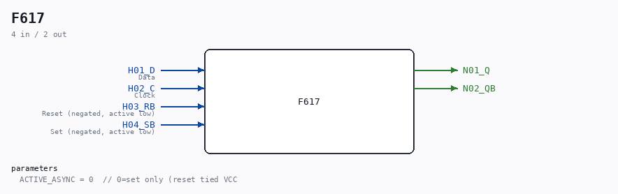

# F617

Source: `/mnt/e/Dev/Repos/Ronny/nd-120/Verilog/DECODE-GateArray/DGA/circuit/F617.v`

> Generated by `Verilog/tests/module_doc.py` from the `//!`
> comments in the source. Do not edit by hand - edit the RTL comments and regenerate.

## Description

ND120 DGA (Decode Gate Array)
DECODE/DGA
NEC F617 - D Flip-Flop with RB, SB
ACTIVE_ASYNC=0 (default): Only async set (reset tied to VCC).
ACTIVE_ASYNC=1: Both async set and reset (original NEC behavior).
Last reviewed: 30-MAR-2026
Ronny Hansen

## Parameters

| Parameter | Default |
|---|---|
| `ACTIVE_ASYNC` | `0  // 0=set only (reset tied VCC` |

## Ports

| Direction | Width | Name | Description |
|---|---|---|---|
| input | `1` | `H01_D` | Data |
| input | `1` | `H02_C` | Clock |
| input | `1` | `H03_RB` | Reset (negated, active low) |
| input | `1` | `H04_SB` | Set (negated, active low) |
| output | `1` | `N01_Q` |  |
| output | `1` | `N02_QB` |  |
