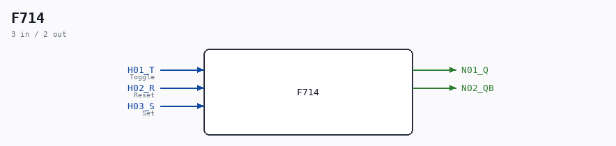

# F714

Source: `/mnt/e/Dev/Repos/Ronny/nd-120/Verilog/DECODE-GateArray/DGA/circuit/F714.v`

> Generated by `Verilog/tests/module_doc.py` from the `//!`
> comments in the source. Do not edit by hand - edit the RTL comments and regenerate.

## Description

ND120 DGA (Decode Gate Array)
DECODE/DGA
NEC F714 - T Flip-Flop with R, S
Last reviewed: 2-FEB-2024
Ronny Hansen

## Ports

| Direction | Width | Name | Description |
|---|---|---|---|
| input | `1` | `H01_T` | Toggle |
| input | `1` | `H02_R` | Reset |
| input | `1` | `H03_S` | Set |
| output | `1` | `N01_Q` |  |
| output | `1` | `N02_QB` |  |
