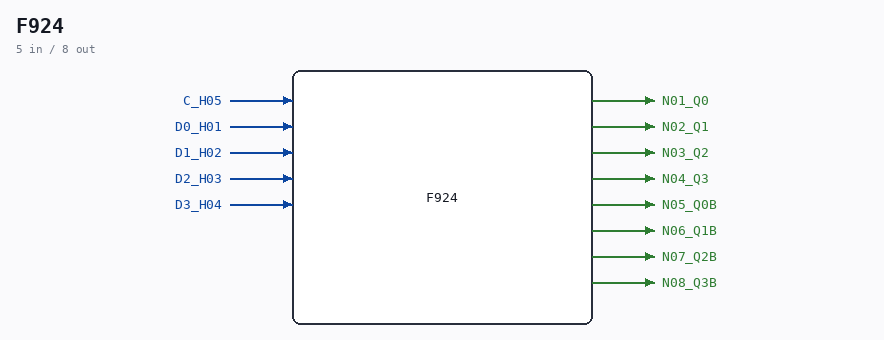

# F924

Source: `/mnt/e/Dev/Repos/Ronny/nd-120/Verilog/DECODE-GateArray/DGA/circuit/F924.v`

> Generated by `Verilog/tests/module_doc.py` from the `//!`
> comments in the source. Do not edit by hand - edit the RTL comments and regenerate.

## Description

ND120 DGA (Decode Gate Array)
DECODE/DGA
NEC F924 - 4-BIT D-TYPE FLIP-FLOP
Last reviewed: 9-NOV-2024
Ronny Hansen

## Ports

| Direction | Width | Name | Description |
|---|---|---|---|
| input | `1` | `C_H05` |  |
| input | `1` | `D0_H01` |  |
| input | `1` | `D1_H02` |  |
| input | `1` | `D2_H03` |  |
| input | `1` | `D3_H04` |  |
| output | `1` | `N01_Q0` |  |
| output | `1` | `N02_Q1` |  |
| output | `1` | `N03_Q2` |  |
| output | `1` | `N04_Q3` |  |
| output | `1` | `N05_Q0B` |  |
| output | `1` | `N06_Q1B` |  |
| output | `1` | `N07_Q2B` |  |
| output | `1` | `N08_Q3B` |  |
