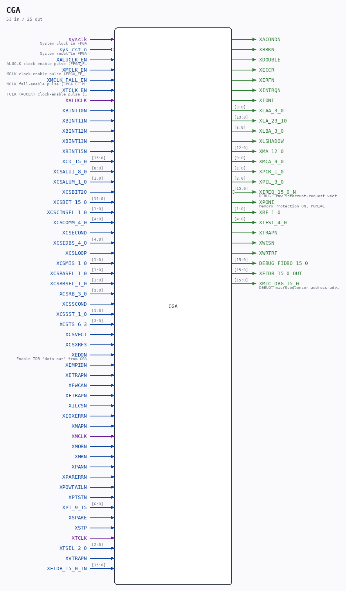

# CGA

Source: `/mnt/e/Dev/Repos/Ronny/nd-120/Verilog/DELILAH-CPU/CGA/circuit/CGA.v`

> Generated by `Verilog/tests/module_doc.py` from the `//!`
> comments in the source. Do not edit by hand - edit the RTL comments and regenerate.

## Description

ND120 CGA (CPU Gate Array / DELILAH)
/CGA
CGA TOP LEVEL
Page 2-9
SHEET 1 of 8
Last reviewed: 9-FEB-2025
Ronny Hansen

## Ports

| Direction | Width | Name | Description |
|---|---|---|---|
| input | `1` | `sysclk` | System clock in FPGA |
| input | `1` | `sys_rst_n` *(active low)* | System reset in FPGA |
| input | `1` | `XALUCLK_EN` | ALUCLK clock-enable pulse (FPGA_FF_MODE, else 0) |
| input | `1` | `XMCLK_EN` | MCLK clock-enable pulse (FPGA_FF_MODE, else 0) |
| input | `1` | `XMCLK_FALL_EN` | MCLK fall-enable pulse (FPGA_FF_MODE, else 0) |
| input | `1` | `XTCLK_EN` | TCLK (=UCLK) clock-enable pulse (FPGA_FF_MODE, else 0) |
| input | `1` | `XALUCLK` |  |
| input | `1` | `XBINT10N` |  |
| input | `1` | `XBINT11N` |  |
| input | `1` | `XBINT12N` |  |
| input | `1` | `XBINT13N` |  |
| input | `1` | `XBINT15N` |  |
| input | `[15:0]` | `XCD_15_0` |  |
| input | `[8:0]` | `XCSALUI_8_0` |  |
| input | `[1:0]` | `XCSALUM_1_0` |  |
| input | `1` | `XCSBIT20` |  |
| input | `[15:0]` | `XCSBIT_15_0` |  |
| input | `[1:0]` | `XCSCINSEL_1_0` |  |
| input | `[4:0]` | `XCSCOMM_4_0` |  |
| input | `1` | `XCSECOND` |  |
| input | `[4:0]` | `XCSIDBS_4_0` |  |
| input | `1` | `XCSLOOP` |  |
| input | `[1:0]` | `XCSMIS_1_0` |  |
| input | `[1:0]` | `XCSRASEL_1_0` |  |
| input | `[1:0]` | `XCSRBSEL_1_0` |  |
| input | `[3:0]` | `XCSRB_3_0` |  |
| input | `1` | `XCSSCOND` |  |
| input | `[1:0]` | `XCSSST_1_0` |  |
| input | `[3:0]` | `XCSTS_6_3` |  |
| input | `1` | `XCSVECT` |  |
| input | `1` | `XCSXRF3` |  |
| input | `1` | `XEDON` | Enable IDB "data out" from CGA |
| input | `1` | `XEMPIDN` |  |
| input | `1` | `XETRAPN` |  |
| input | `1` | `XEWCAN` |  |
| input | `1` | `XFTRAPN` |  |
| input | `1` | `XILCSN` |  |
| input | `1` | `XIOXERRN` |  |
| input | `1` | `XMAPN` |  |
| input | `1` | `XMCLK` |  |
| input | `1` | `XMORN` |  |
| input | `1` | `XMRN` |  |
| input | `1` | `XPANN` |  |
| input | `1` | `XPARERRN` |  |
| input | `1` | `XPOWFAILN` |  |
| input | `1` | `XPTSTN` |  |
| input | `[6:0]` | `XPT_9_15` |  |
| input | `1` | `XSPARE` |  |
| input | `1` | `XSTP` |  |
| input | `1` | `XTCLK` |  |
| input | `[2:0]` | `XTSEL_2_0` |  |
| input | `1` | `XVTRAPN` |  |
| input | `[15:0]` | `XFIDB_15_0_IN` |  |
| output | `1` | `XACONDN` |  |
| output | `1` | `XBRKN` |  |
| output | `1` | `XDOUBLE` |  |
| output | `1` | `XECCR` |  |
| output | `1` | `XERFN` |  |
| output | `1` | `XINTRQN` |  |
| output | `1` | `XIONI` |  |
| output | `[3:0]` | `XLAA_3_0` |  |
| output | `[13:0]` | `XLA_23_10` |  |
| output | `[3:0]` | `XLBA_3_0` |  |
| output | `1` | `XLSHADOW` |  |
| output | `[12:0]` | `XMA_12_0` |  |
| output | `[9:0]` | `XMCA_9_0` |  |
| output | `[1:0]` | `XPCR_1_0` |  |
| output | `[3:0]` | `XPIL_3_0` |  |
| output | `[15:0]` | `XIREQ_15_0_N` *(active low)* | DEBUG: raw interrupt-request vector (active low) |
| output | `1` | `XPONI` | Memory Protection ON, PONI=1 |
| output | `[1:0]` | `XRF_1_0` |  |
| output | `[4:0]` | `XTEST_4_0` |  |
| output | `1` | `XTRAPN` |  |
| output | `1` | `XWCSN` |  |
| output | `1` | `XWRTRF` |  |
| output | `[15:0]` | `DEBUG_FIDBO_15_0` |  |
| output | `[15:0]` | `XFIDB_15_0_OUT` |  |
| output | `[15:0]` | `XMIC_DBG_15_0` | DEBUG: microsequencer address-advance probe (Tang 06000-hang) |
