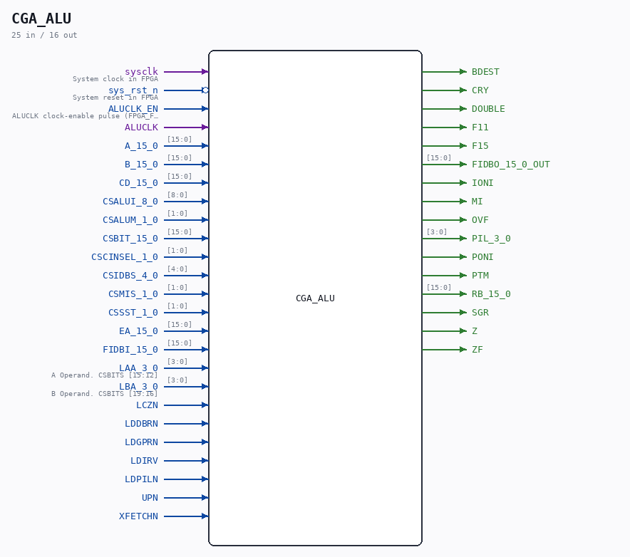

# CGA_ALU

Source: `/mnt/e/Dev/Repos/Ronny/nd-120/Verilog/DELILAH-CPU/CGA_ALU/circuit/CGA_ALU.v`

> Generated by `Verilog/tests/module_doc.py` from the `//!`
> comments in the source. Do not edit by hand - edit the RTL comments and regenerate.

## Description

ND120 CGA (CPU Gate Array / DELILAH)
/CGA/ALU/OUTMUX
OUT MUX
Page 41
SHEET 1 of 1
Last reviewed: 29-JAN-2025
Ronny Hansen

## Ports

| Direction | Width | Name | Description |
|---|---|---|---|
| input | `1` | `sysclk` | System clock in FPGA |
| input | `1` | `sys_rst_n` *(active low)* | System reset in FPGA |
| input | `1` | `ALUCLK_EN` | ALUCLK clock-enable pulse (FPGA_FF_MODE, else 0) |
| input | `1` | `ALUCLK` |  |
| input | `[15:0]` | `A_15_0` |  |
| input | `[15:0]` | `B_15_0` |  |
| input | `[15:0]` | `CD_15_0` |  |
| input | `[8:0]` | `CSALUI_8_0` |  |
| input | `[1:0]` | `CSALUM_1_0` |  |
| input | `[15:0]` | `CSBIT_15_0` |  |
| input | `[1:0]` | `CSCINSEL_1_0` |  |
| input | `[4:0]` | `CSIDBS_4_0` |  |
| input | `[1:0]` | `CSMIS_1_0` |  |
| input | `[1:0]` | `CSSST_1_0` |  |
| input | `[15:0]` | `EA_15_0` |  |
| input | `[15:0]` | `FIDBI_15_0` |  |
| input | `[3:0]` | `LAA_3_0` | A Operand. CSBITS [15:12] |
| input | `[3:0]` | `LBA_3_0` | B Operand. CSBITS [19:16] |
| input | `1` | `LCZN` |  |
| input | `1` | `LDDBRN` |  |
| input | `1` | `LDGPRN` |  |
| input | `1` | `LDIRV` |  |
| input | `1` | `LDPILN` |  |
| input | `1` | `UPN` |  |
| input | `1` | `XFETCHN` |  |
| output | `1` | `BDEST` |  |
| output | `1` | `CRY` |  |
| output | `1` | `DOUBLE` |  |
| output | `1` | `F11` |  |
| output | `1` | `F15` |  |
| output | `[15:0]` | `FIDBO_15_0_OUT` |  |
| output | `1` | `IONI` |  |
| output | `1` | `MI` |  |
| output | `1` | `OVF` |  |
| output | `[3:0]` | `PIL_3_0` |  |
| output | `1` | `PONI` |  |
| output | `1` | `PTM` |  |
| output | `[15:0]` | `RB_15_0` |  |
| output | `1` | `SGR` |  |
| output | `1` | `Z` |  |
| output | `1` | `ZF` |  |
