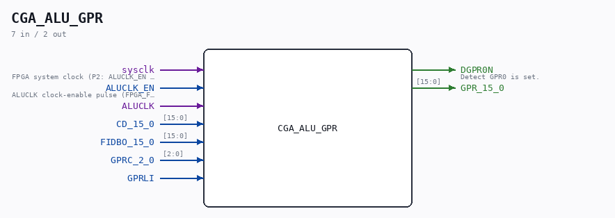

# CGA_ALU_GPR

Source: `/mnt/e/Dev/Repos/Ronny/nd-120/Verilog/DELILAH-CPU/CGA_ALU/circuit/CGA_ALU_GPR.v`

> Generated by `Verilog/tests/module_doc.py` from the `//!`
> comments in the source. Do not edit by hand - edit the RTL comments and regenerate.

## Description

ND120 CGA (CPU Gate Array / DELILAH)
/CGA/ALU/GPR
Page 50
SHEET 1 of 1
Last reviewed: 20-DEC-2024
Ronny Hansen

## Ports

| Direction | Width | Name | Description |
|---|---|---|---|
| input | `1` | `sysclk` | FPGA system clock (P2: ALUCLK_EN capture) |
| input | `1` | `ALUCLK_EN` | ALUCLK clock-enable pulse (FPGA_FF_MODE, else 0) |
| input | `1` | `ALUCLK` |  |
| input | `[15:0]` | `CD_15_0` |  |
| input | `[15:0]` | `FIDBO_15_0` |  |
| input | `[2:0]` | `GPRC_2_0` |  |
| input | `1` | `GPRLI` |  |
| output | `1` | `DGPR0N` | Detect GPR0 is set. |
| output | `[15:0]` | `GPR_15_0` |  |
