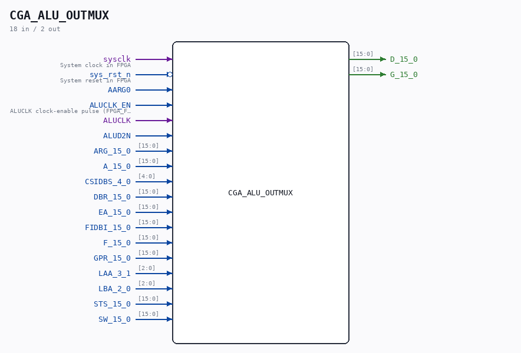

# CGA_ALU_OUTMUX

Source: `/mnt/e/Dev/Repos/Ronny/nd-120/Verilog/DELILAH-CPU/CGA_ALU/circuit/CGA_ALU_OUTMUX.v`

> Generated by `Verilog/tests/module_doc.py` from the `//!`
> comments in the source. Do not edit by hand - edit the RTL comments and regenerate.

## Description

ND120 CGA (CPU Gate Array / DELILAH)
/CGA/ALU/OUTMUX
OUT MUX
Page 55
SHEET 1 of 1
Last reviewed: 29-JAN-2025
Ronny Hansen

## Ports

| Direction | Width | Name | Description |
|---|---|---|---|
| input | `1` | `sysclk` | System clock in FPGA |
| input | `1` | `sys_rst_n` *(active low)* | System reset in FPGA |
| input | `1` | `AARG0` |  |
| input | `1` | `ALUCLK_EN` | ALUCLK clock-enable pulse (FPGA_FF_MODE, else 0) |
| input | `1` | `ALUCLK` |  |
| input | `1` | `ALUD2N` |  |
| input | `[15:0]` | `ARG_15_0` |  |
| input | `[15:0]` | `A_15_0` |  |
| input | `[4:0]` | `CSIDBS_4_0` |  |
| input | `[15:0]` | `DBR_15_0` |  |
| input | `[15:0]` | `EA_15_0` |  |
| input | `[15:0]` | `FIDBI_15_0` |  |
| input | `[15:0]` | `F_15_0` |  |
| input | `[15:0]` | `GPR_15_0` |  |
| input | `[2:0]` | `LAA_3_1` |  |
| input | `[2:0]` | `LBA_2_0` |  |
| input | `[15:0]` | `STS_15_0` |  |
| input | `[15:0]` | `SW_15_0` |  |
| output | `[15:0]` | `D_15_0` |  |
| output | `[15:0]` | `G_15_0` |  |
