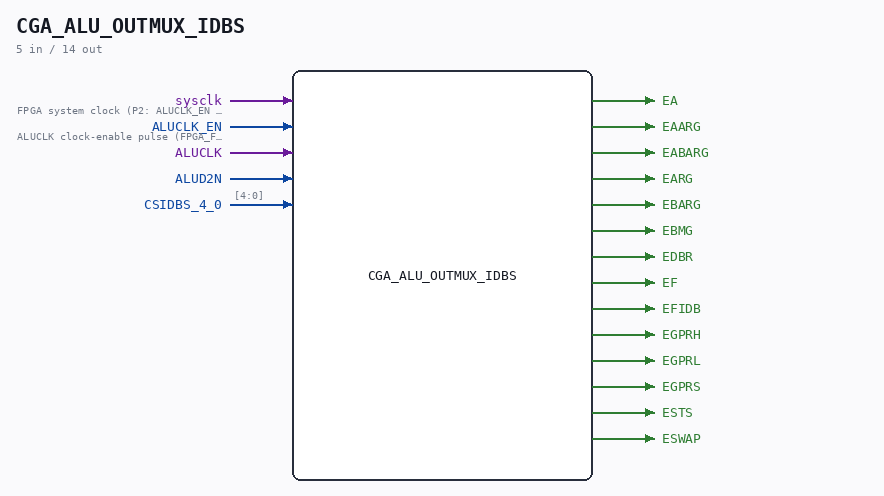

# CGA_ALU_OUTMUX_IDBS

Source: `/mnt/e/Dev/Repos/Ronny/nd-120/Verilog/DELILAH-CPU/CGA_ALU/circuit/CGA_ALU_OUTMUX_IDBS.v`

> Generated by `Verilog/tests/module_doc.py` from the `//!`
> comments in the source. Do not edit by hand - edit the RTL comments and regenerate.

## Description

ND120 CGA (CPU Gate Array / DELILAH)
/CGA/ALU/OUTMUX/IDBS
IDBS MUX
Page 55
SHEET 1 of 1
Last reviewed: 9-FEB-2025
Ronny Hansen

## Ports

| Direction | Width | Name | Description |
|---|---|---|---|
| input | `1` | `sysclk` | FPGA system clock (P2: ALUCLK_EN capture) |
| input | `1` | `ALUCLK_EN` | ALUCLK clock-enable pulse (FPGA_FF_MODE, else 0) |
| input | `1` | `ALUCLK` |  |
| input | `1` | `ALUD2N` |  |
| input | `[4:0]` | `CSIDBS_4_0` |  |
| output | `1` | `EA` |  |
| output | `1` | `EAARG` |  |
| output | `1` | `EABARG` |  |
| output | `1` | `EARG` |  |
| output | `1` | `EBARG` |  |
| output | `1` | `EBMG` |  |
| output | `1` | `EDBR` |  |
| output | `1` | `EF` |  |
| output | `1` | `EFIDB` |  |
| output | `1` | `EGPRH` |  |
| output | `1` | `EGPRL` |  |
| output | `1` | `EGPRS` |  |
| output | `1` | `ESTS` |  |
| output | `1` | `ESWAP` |  |
