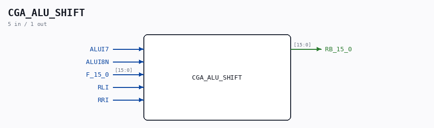

# CGA_ALU_SHIFT

Source: `/mnt/e/Dev/Repos/Ronny/nd-120/Verilog/DELILAH-CPU/CGA_ALU/circuit/CGA_ALU_SHIFT.v`

> Generated by `Verilog/tests/module_doc.py` from the `//!`
> comments in the source. Do not edit by hand - edit the RTL comments and regenerate.

## Description

ND120 CGA (CPU Gate Array / DELILAH)
/CGA/ALU/SHIFT
Page 49
SHEET 1 of 1
Last reviewed: 10-NOV-2024
Ronny Hansen

## Ports

| Direction | Width | Name | Description |
|---|---|---|---|
| input | `1` | `ALUI7` |  |
| input | `1` | `ALUI8N` |  |
| input | `[15:0]` | `F_15_0` |  |
| input | `1` | `RLI` |  |
| input | `1` | `RRI` |  |
| output | `[15:0]` | `RB_15_0` |  |
