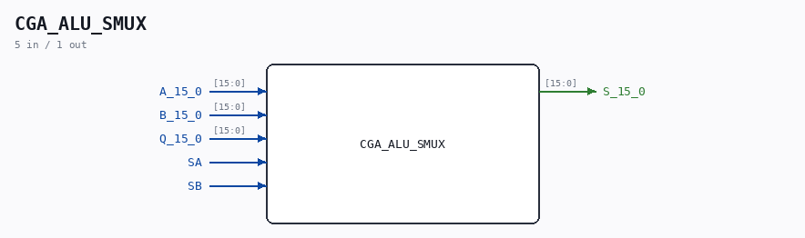

# CGA_ALU_SMUX

Source: `/mnt/e/Dev/Repos/Ronny/nd-120/Verilog/DELILAH-CPU/CGA_ALU/circuit/CGA_ALU_SMUX.v`

> Generated by `Verilog/tests/module_doc.py` from the `//!`
> comments in the source. Do not edit by hand - edit the RTL comments and regenerate.

## Description

ND120 CGA (CPU Gate Array / DELILAH)
/CGA/ALU/SMUX
SMUX
Page 45
SHEET 1 of 1
Last reviewed: 10-NOV-2024
Ronny Hansen

## Ports

| Direction | Width | Name | Description |
|---|---|---|---|
| input | `[15:0]` | `A_15_0` |  |
| input | `[15:0]` | `B_15_0` |  |
| input | `[15:0]` | `Q_15_0` |  |
| input | `1` | `SA` |  |
| input | `1` | `SB` |  |
| output | `[15:0]` | `S_15_0` |  |
