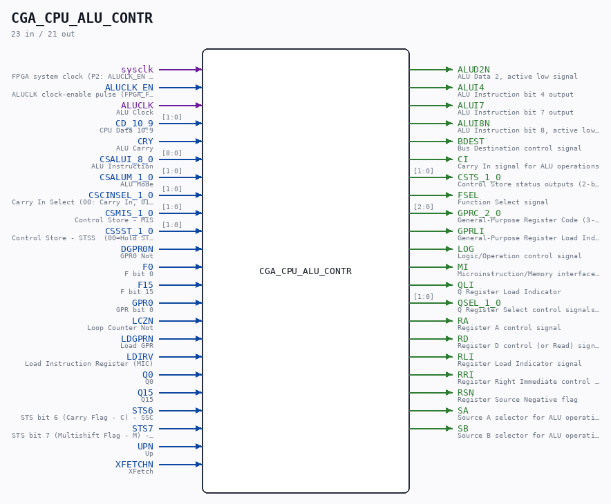

# CGA_CPU_ALU_CONTR

Source: `/mnt/e/Dev/Repos/Ronny/nd-120/Verilog/DELILAH-CPU/CGA_ALU/circuit/CGA_CPU_ALU_CONTR.v`

> Generated by `Verilog/tests/module_doc.py` from the `//!`
> comments in the source. Do not edit by hand - edit the RTL comments and regenerate.

## Description

ND120 CGA (CPU Gate Array / DELILAH)
/CGA/ALU/CONTR
ALU CONTROLLER
Page 42
SHEET 1 of 1
Last reviewed: 22-MAR-2025
Ronny Hansen

## Ports

| Direction | Width | Name | Description |
|---|---|---|---|
| input | `1` | `sysclk` | FPGA system clock (P2: ALUCLK_EN capture) |
| input | `1` | `ALUCLK_EN` | ALUCLK clock-enable pulse (FPGA_FF_MODE, else 0) |
| input | `1` | `ALUCLK` | ALU Clock |
| input | `[1:0]` | `CD_10_9` | CPU Data 10:9 |
| input | `1` | `CRY` | ALU Carry |
| input | `[8:0]` | `CSALUI_8_0` | ALU Instruction |
| input | `[1:0]` | `CSALUM_1_0` | ALU Mode |
| input | `[1:0]` | `CSCINSEL_1_0` | Carry In Select (00: Carry In, 01: Carry In Not, 10: Carry In Not, 11: Carry In) |
| input | `[1:0]` | `CSMIS_1_0` | Control Store - MIS |
| input | `[1:0]` | `CSSST_1_0` | Control Store - STSS  (00=Hold STS, 01=Enable Set C O Q, 10=Enable set M, 11=Load STS) |
| input | `1` | `DGPR0N` | GPR0 Not |
| input | `1` | `F0` | F bit 0 |
| input | `1` | `F15` | F bit 15 |
| input | `1` | `GPR0` | GPR bit 0 |
| input | `1` | `LCZN` | Loop Counter Not |
| input | `1` | `LDGPRN` | Load GPR |
| input | `1` | `LDIRV` | Load Instruction Register (MIC) |
| input | `1` | `Q0` | Q0 |
| input | `1` | `Q15` | Q15 |
| input | `1` | `STS6` | STS bit 6 (Carry Flag - C) - SSC |
| input | `1` | `STS7` | STS bit 7 (Multishift Flag - M) - SSM |
| input | `1` | `UPN` | Up |
| input | `1` | `XFETCHN` | XFetch |
| output | `1` | `ALUD2N` | ALU Data 2, active low signal |
| output | `1` | `ALUI4` | ALU Instruction bit 4 output |
| output | `1` | `ALUI7` | ALU Instruction bit 7 output |
| output | `1` | `ALUI8N` | ALU Instruction bit 8, active low output |
| output | `1` | `BDEST` | Bus Destination control signal |
| output | `1` | `CI` | Carry In signal for ALU operations |
| output | `[1:0]` | `CSTS_1_0` | Control Store status outputs (2-bit) |
| output | `1` | `FSEL` | Function Select signal |
| output | `[2:0]` | `GPRC_2_0` | General-Purpose Register Code (3-bit) |
| output | `1` | `GPRLI` | General-Purpose Register Load Indicator |
| output | `1` | `LOG` | Logic/Operation control signal |
| output | `1` | `MI` | Microinstruction/Memory interface indicator |
| output | `1` | `QLI` | Q Register Load Indicator |
| output | `[1:0]` | `QSEL_1_0` | Q Register Select control signals (2-bit) |
| output | `1` | `RA` | Register A control signal |
| output | `1` | `RD` | Register D control (or Read) signal |
| output | `1` | `RLI` | Register Load Indicator signal |
| output | `1` | `RRI` | Register Right Immediate control signal |
| output | `1` | `RSN` | Register Source Negative flag |
| output | `1` | `SA` | Source A selector for ALU operations |
| output | `1` | `SB` | Source B selector for ALU operations |
