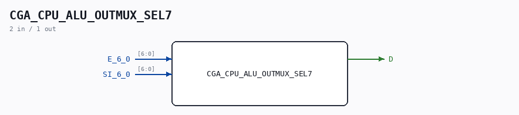

# CGA_CPU_ALU_OUTMUX_SEL7

Source: `/mnt/e/Dev/Repos/Ronny/nd-120/Verilog/DELILAH-CPU/CGA_ALU/circuit/CGA_CPU_ALU_OUTMUX_SEL7.v`

> Generated by `Verilog/tests/module_doc.py` from the `//!`
> comments in the source. Do not edit by hand - edit the RTL comments and regenerate.

## Description

ND120 CGA (CPU Gate Array / DELILAH)
/CGA/ALU/OUTMUX/SEL7
SEL7
Page 57
SHEET 1 of 1
Last reviewed: 10-NOV-2024
Ronny Hansen

## Ports

| Direction | Width | Name | Description |
|---|---|---|---|
| input | `[6:0]` | `E_6_0` |  |
| input | `[6:0]` | `SI_6_0` |  |
| output | `1` | `D` |  |
