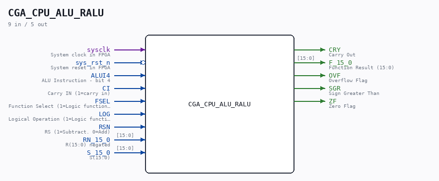

# CGA_CPU_ALU_RALU

Source: `/mnt/e/Dev/Repos/Ronny/nd-120/Verilog/DELILAH-CPU/CGA_ALU/circuit/CGA_CPU_ALU_RALU.v`

> Generated by `Verilog/tests/module_doc.py` from the `//!`
> comments in the source. Do not edit by hand - edit the RTL comments and regenerate.

## Description

ND120 CGA (CPU Gate Array / DELILAH)
/CGA/ALU/RALU
RALU
Page 46
SHEET 1 of 1
Last reviewed: 20-DEC-2024
Ronny Hansen

## Ports

| Direction | Width | Name | Description |
|---|---|---|---|
| input | `1` | `sysclk` | System clock in FPGA |
| input | `1` | `sys_rst_n` *(active low)* | System reset in FPGA |
| input | `1` | `ALUI4` | ALU Instruction - bit 4 |
| input | `1` | `CI` | Carry IN (1=carry in) |
| input | `1` | `FSEL` | Function Select (1=Logic function (XOR), 0=OR/AND/NOT) |
| input | `1` | `LOG` | Logical Operation (1=Logic function (AND/OR). 0=ADD/SUB) |
| input | `1` | `RSN` | RS (1=Subtract. 0=Add) |
| input | `[15:0]` | `RN_15_0` | R(15:0) negated |
| input | `[15:0]` | `S_15_0` | S(15:0) |
| output | `1` | `CRY` | Carry Out |
| output | `[15:0]` | `F_15_0` | Function Result (15:0) |
| output | `1` | `OVF` | Overflow Flag |
| output | `1` | `SGR` | Sign Greater Than |
| output | `1` | `ZF` | Zero Flag |
