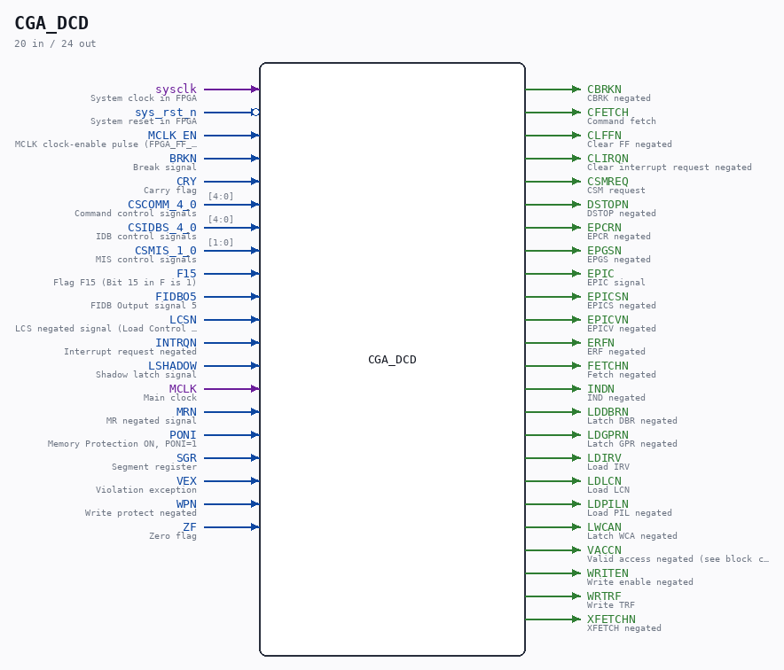

# CGA_DCD

Source: `/mnt/e/Dev/Repos/Ronny/nd-120/Verilog/DELILAH-CPU/CGA_DCD/circuit/CGA_DCD.v`

> Generated by `Verilog/tests/module_doc.py` from the `//!`
> comments in the source. Do not edit by hand - edit the RTL comments and regenerate.

## Description

CPU GATE ARRAY - CGA - DELILAH
CGA/DCD - Decoder
Sheet 1-10 of 10
PDF page 65-73+75 of 108
Last reviewed: 9-FEB-2025
Ronny Hansen

## Ports

| Direction | Width | Name | Description |
|---|---|---|---|
| input | `1` | `sysclk` | System clock in FPGA |
| input | `1` | `sys_rst_n` *(active low)* | System reset in FPGA |
| input | `1` | `MCLK_EN` | MCLK clock-enable pulse (FPGA_FF_MODE, else 0) |
| input | `1` | `BRKN` | Break signal |
| input | `1` | `CRY` | Carry flag |
| input | `[4:0]` | `CSCOMM_4_0` | Command control signals |
| input | `[4:0]` | `CSIDBS_4_0` | IDB control signals |
| input | `[1:0]` | `CSMIS_1_0` | MIS control signals |
| input | `1` | `F15` | Flag F15 (Bit 15 in F is 1) |
| input | `1` | `FIDBO5` | FIDB Output signal 5 |
| input | `1` | `LCSN` | LCS negated signal (Load Control Store) |
| input | `1` | `INTRQN` | Interrupt request negated |
| input | `1` | `LSHADOW` | Shadow latch signal |
| input | `1` | `MCLK` | Main clock |
| input | `1` | `MRN` | MR negated signal |
| input | `1` | `PONI` | Memory Protection ON, PONI=1 |
| input | `1` | `SGR` | Segment register |
| input | `1` | `VEX` | Violation exception |
| input | `1` | `WPN` | Write protect negated |
| input | `1` | `ZF` | Zero flag |
| output | `1` | `CBRKN` | CBRK negated |
| output | `1` | `CFETCH` | Command fetch |
| output | `1` | `CLFFN` | Clear FF negated |
| output | `1` | `CLIRQN` | Clear interrupt request negated |
| output | `1` | `CSMREQ` | CSM request |
| output | `1` | `DSTOPN` | DSTOP negated |
| output | `1` | `EPCRN` | EPCR negated |
| output | `1` | `EPGSN` | EPGS negated |
| output | `1` | `EPIC` | EPIC signal |
| output | `1` | `EPICSN` | EPICS negated |
| output | `1` | `EPICVN` | EPICV negated |
| output | `1` | `ERFN` | ERF negated |
| output | `1` | `FETCHN` | Fetch negated |
| output | `1` | `INDN` | IND negated |
| output | `1` | `LDDBRN` | Latch DBR negated |
| output | `1` | `LDGPRN` | Latch GPR negated |
| output | `1` | `LDIRV` | Load IRV |
| output | `1` | `LDLCN` | Load LCN |
| output | `1` | `LDPILN` | Load PIL negated |
| output | `1` | `LWCAN` | Latch WCA negated |
| output | `1` | `VACCN` | Valid access negated (see block comment, sheet 10/10) |
| output | `1` | `WRITEN` | Write enable negated |
| output | `1` | `WRTRF` | Write TRF |
| output | `1` | `XFETCHN` | XFETCH negated |
