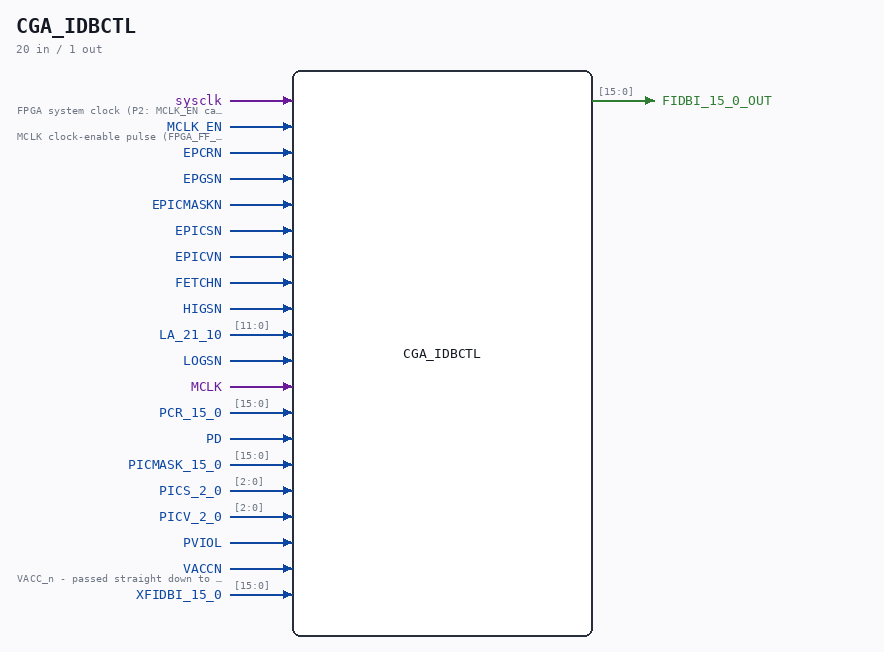

# CGA_IDBCTL

Source: `/mnt/e/Dev/Repos/Ronny/nd-120/Verilog/DELILAH-CPU/CGA_IDBCTL/circuit/CGA_IDBCTL.v`

> Generated by `Verilog/tests/module_doc.py` from the `//!`
> comments in the source. Do not edit by hand - edit the RTL comments and regenerate.

## Description

CPU GATE ARRAY - CGA - DELILAH
CGA/IDBCTL - IDB Control Logic
PDF page 97 of 108
Last reviewed: 02-FEB-2025
Ronny Hansen

## Ports

| Direction | Width | Name | Description |
|---|---|---|---|
| input | `1` | `sysclk` | FPGA system clock (P2: MCLK_EN capture) |
| input | `1` | `MCLK_EN` | MCLK clock-enable pulse (FPGA_FF_MODE, else 0) |
| input | `1` | `EPCRN` |  |
| input | `1` | `EPGSN` |  |
| input | `1` | `EPICMASKN` |  |
| input | `1` | `EPICSN` |  |
| input | `1` | `EPICVN` |  |
| input | `1` | `FETCHN` |  |
| input | `1` | `HIGSN` |  |
| input | `[11:0]` | `LA_21_10` |  |
| input | `1` | `LOGSN` |  |
| input | `1` | `MCLK` |  |
| input | `[15:0]` | `PCR_15_0` |  |
| input | `1` | `PD` |  |
| input | `[15:0]` | `PICMASK_15_0` |  |
| input | `[2:0]` | `PICS_2_0` |  |
| input | `[2:0]` | `PICV_2_0` |  |
| input | `1` | `PVIOL` |  |
| input | `1` | `VACCN` | VACC_n - passed straight down to CGA_IDBCTL_PGSREG as its load enable |
| input | `[15:0]` | `XFIDBI_15_0` |  |
| output | `[15:0]` | `FIDBI_15_0_OUT` |  |
