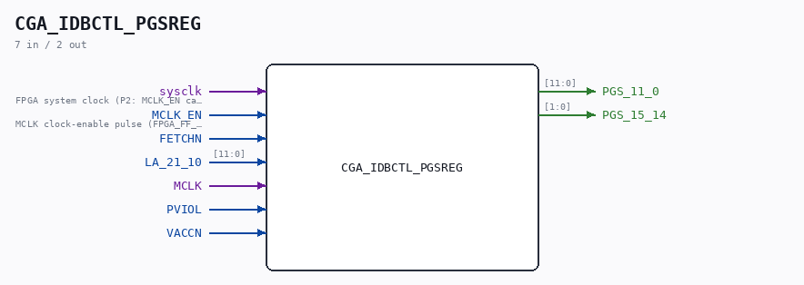

# CGA_IDBCTL_PGSREG

Source: `/mnt/e/Dev/Repos/Ronny/nd-120/Verilog/DELILAH-CPU/CGA_IDBCTL/circuit/CGA_IDBCTL_PGSREG.v`

> Generated by `Verilog/tests/module_doc.py` from the `//!`
> comments in the source. Do not edit by hand - edit the RTL comments and regenerate.

## Description

CPU GATE ARRAY - CGA - DELILAH
CGA/IDBCTL/PGSREG - IDB Control Logic
PDF page 98 of 108
Last reviewed: 9-NOV-2024
Ronny Hansen

## Ports

| Direction | Width | Name | Description |
|---|---|---|---|
| input | `1` | `sysclk` | FPGA system clock (P2: MCLK_EN capture) |
| input | `1` | `MCLK_EN` | MCLK clock-enable pulse (FPGA_FF_MODE, else 0) |
| input | `1` | `FETCHN` |  |
| input | `[11:0]` | `LA_21_10` |  |
| input | `1` | `MCLK` |  |
| input | `1` | `PVIOL` |  |
| input | `1` | `VACCN` |  |
| output | `[11:0]` | `PGS_11_0` |  |
| output | `[1:0]` | `PGS_15_14` |  |
