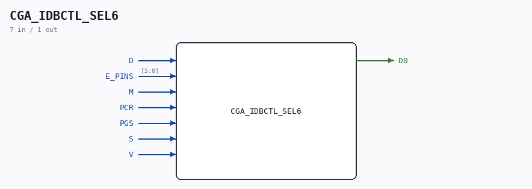

# CGA_IDBCTL_SEL6

Source: `/mnt/e/Dev/Repos/Ronny/nd-120/Verilog/DELILAH-CPU/CGA_IDBCTL/circuit/CGA_IDBCTL_SEL6.v`

> Generated by `Verilog/tests/module_doc.py` from the `//!`
> comments in the source. Do not edit by hand - edit the RTL comments and regenerate.

## Description

CPU GATE ARRAY - CGA - DELILAH
CGA/IDBCTL/SEL6 - IDB Control Logic
PDF page 99 of 108
Last reviewed: 9-NOV-2024
Ronny Hansen

## Ports

| Direction | Width | Name | Description |
|---|---|---|---|
| input | `1` | `D` |  |
| input | `[5:0]` | `E_PINS` |  |
| input | `1` | `M` |  |
| input | `1` | `PCR` |  |
| input | `1` | `PGS` |  |
| input | `1` | `S` |  |
| input | `1` | `V` |  |
| output | `1` | `D0` |  |
