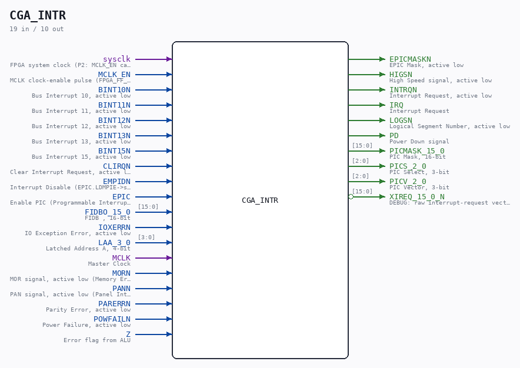

# CGA_INTR

Source: `/mnt/e/Dev/Repos/Ronny/nd-120/Verilog/DELILAH-CPU/CGA_INTR/circuit/CGA_INTR.v`

> Generated by `Verilog/tests/module_doc.py` from the `//!`
> comments in the source. Do not edit by hand - edit the RTL comments and regenerate.

## Description

CPU GATE ARRAY - CGA - DELILAH
CGA/INTR
Sheet 1 of 1
PDF page 74
Last reviewed: 26-JAN-2025
Ronny Hansen

## Ports

| Direction | Width | Name | Description |
|---|---|---|---|
| input | `1` | `sysclk` | FPGA system clock (P2: MCLK_EN capture) |
| input | `1` | `MCLK_EN` | MCLK clock-enable pulse (FPGA_FF_MODE, else 0) |
| input | `1` | `BINT10N` | Bus Interrupt 10, active low |
| input | `1` | `BINT11N` | Bus Interrupt 11, active low |
| input | `1` | `BINT12N` | Bus Interrupt 12, active low |
| input | `1` | `BINT13N` | Bus Interrupt 13, active low |
| input | `1` | `BINT15N` | Bus Interrupt 15, active low |
| input | `1` | `CLIRQN` | Clear Interrupt Request, active low |
| input | `1` | `EMPIDN` | Interrupt Disable (EPIC.LDMPIE->set mask reg:inh all ints) |
| input | `1` | `EPIC` | Enable PIC (Programmable Interrupt Controller) signal |
| input | `[15:0]` | `FIDBO_15_0` | FIDB , 16-bit |
| input | `1` | `IOXERRN` | IO Exception Error, active low |
| input | `[3:0]` | `LAA_3_0` | Latched Address A, 4-bit |
| input | `1` | `MCLK` | Master Clock |
| input | `1` | `MORN` | MOR signal, active low (Memory Error) |
| input | `1` | `PANN` | PAN signal, active low (Panel Interrupt) |
| input | `1` | `PARERRN` | Parity Error, active low |
| input | `1` | `POWFAILN` | Power Failure, active low |
| input | `1` | `Z` | Error flag from ALU |
| output | `1` | `EPICMASKN` | EPIC Mask, active low |
| output | `1` | `HIGSN` | High Speed signal, active low |
| output | `1` | `INTRQN` | Interrupt Request, active low |
| output | `1` | `IRQ` | Interrupt Request |
| output | `1` | `LOGSN` | Logical Segment Number, active low |
| output | `1` | `PD` | Power Down signal |
| output | `[15:0]` | `PICMASK_15_0` | PIC Mask, 16-bit |
| output | `[2:0]` | `PICS_2_0` | PIC Select, 3-bit |
| output | `[2:0]` | `PICV_2_0` | PIC Vector, 3-bit |
| output | `[15:0]` | `XIREQ_15_0_N` *(active low)* | DEBUG: raw interrupt-request vector (active low) for grant-source capture |
