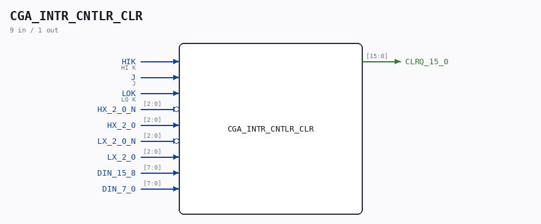

# CGA_INTR_CNTLR_CLR

Source: `/mnt/e/Dev/Repos/Ronny/nd-120/Verilog/DELILAH-CPU/CGA_INTR/circuit/CGA_INTR_CNTLR_CLR.v`

> Generated by `Verilog/tests/module_doc.py` from the `//!`
> comments in the source. Do not edit by hand - edit the RTL comments and regenerate.

## Description

ND120 CGA (CPU Gate Array / DELILAH)
/CGA/INTR/CNTLR/CLR
CLR
Page 82
SHEET 1 of 1
Last reviewed: 10-NOV-2024
Ronny Hansen

## Ports

| Direction | Width | Name | Description |
|---|---|---|---|
| input | `1` | `HIK` | HI K |
| input | `1` | `J` | J |
| input | `1` | `LOK` | LO K |
| input | `[2:0]` | `HX_2_0_N` *(active low)* |  |
| input | `[2:0]` | `HX_2_0` |  |
| input | `[2:0]` | `LX_2_0_N` *(active low)* |  |
| input | `[2:0]` | `LX_2_0` |  |
| input | `[7:0]` | `DIN_15_8` |  |
| input | `[7:0]` | `DIN_7_0` |  |
| output | `[15:0]` | `CLRQ_15_0` |  |
