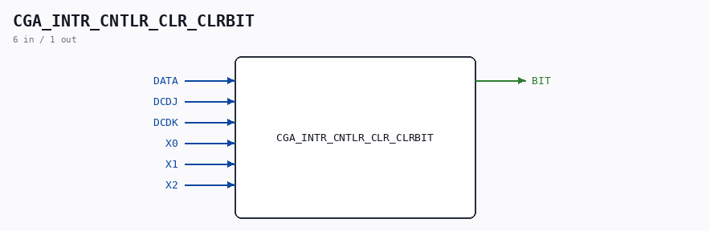

# CGA_INTR_CNTLR_CLR_CLRBIT

Source: `/mnt/e/Dev/Repos/Ronny/nd-120/Verilog/DELILAH-CPU/CGA_INTR/circuit/CGA_INTR_CNTLR_CLR_CLRBIT.v`

> Generated by `Verilog/tests/module_doc.py` from the `//!`
> comments in the source. Do not edit by hand - edit the RTL comments and regenerate.

## Description

ND120 CGA (CPU Gate Array / DELILAH)
/CGA/INTR/CNTLR/CLR/CLRBIT
CLRBIT
Page 82
SHEET 1 of 1
Last reviewed: 10-NOV-2024
Ronny Hansen

## Ports

| Direction | Width | Name | Description |
|---|---|---|---|
| input | `1` | `DATA` |  |
| input | `1` | `DCDJ` |  |
| input | `1` | `DCDK` |  |
| input | `1` | `X0` |  |
| input | `1` | `X1` |  |
| input | `1` | `X2` |  |
| output | `1` | `BIT` |  |
