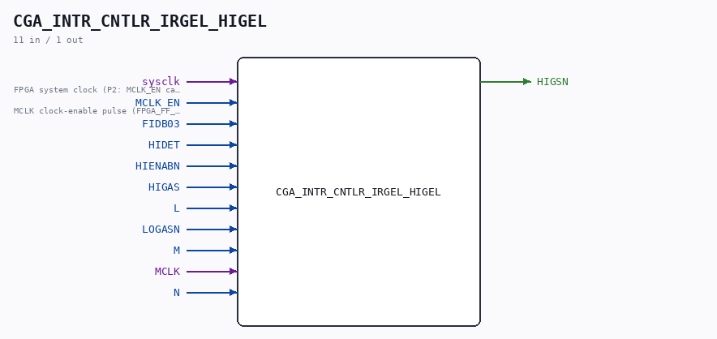

# CGA_INTR_CNTLR_IRGEL_HIGEL

Source: `/mnt/e/Dev/Repos/Ronny/nd-120/Verilog/DELILAH-CPU/CGA_INTR/circuit/CGA_INTR_CNTLR_IRGEL_HIGEL.v`

> Generated by `Verilog/tests/module_doc.py` from the `//!`
> comments in the source. Do not edit by hand - edit the RTL comments and regenerate.

## Description

ND120 CGA (CPU Gate Array / DELILAH)
/CGA/INTR/CNTLR/IRGEL/HIGEL
HIGEL
Page 93
SHEET 1 of 1
Last reviewed: 10-NOV-2024
Ronny Hansen

## Ports

| Direction | Width | Name | Description |
|---|---|---|---|
| input | `1` | `sysclk` | FPGA system clock (P2: MCLK_EN capture) |
| input | `1` | `MCLK_EN` | MCLK clock-enable pulse (FPGA_FF_MODE, else 0) |
| input | `1` | `FIDB03` |  |
| input | `1` | `HIDET` |  |
| input | `1` | `HIENABN` |  |
| input | `1` | `HIGAS` |  |
| input | `1` | `L` |  |
| input | `1` | `LOGASN` |  |
| input | `1` | `M` |  |
| input | `1` | `MCLK` |  |
| input | `1` | `N` |  |
| output | `1` | `HIGSN` |  |
