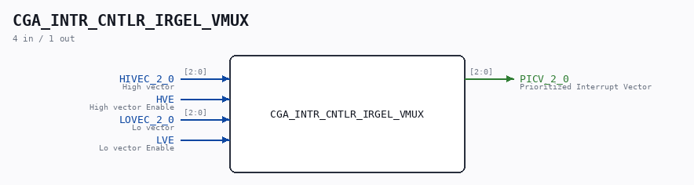

# CGA_INTR_CNTLR_IRGEL_VMUX

Source: `/mnt/e/Dev/Repos/Ronny/nd-120/Verilog/DELILAH-CPU/CGA_INTR/circuit/CGA_INTR_CNTLR_IRGEL_VMUX.v`

> Generated by `Verilog/tests/module_doc.py` from the `//!`
> comments in the source. Do not edit by hand - edit the RTL comments and regenerate.

## Description

ND120 CGA (CPU Gate Array / DELILAH)
/CGA/INTR/CNTLR/IRGEL/VMUX
VECTOR MUX
Page 95
SHEET 1 of 1
Last reviewed: 10-NOV-2024
Ronny Hansen

## Ports

| Direction | Width | Name | Description |
|---|---|---|---|
| input | `[2:0]` | `HIVEC_2_0` | High vector |
| input | `1` | `HVE` | High vector Enable |
| input | `[2:0]` | `LOVEC_2_0` | Lo vector |
| input | `1` | `LVE` | Lo vector Enable |
| output | `[2:0]` | `PICV_2_0` | Prioritized Interrupt Vector |
