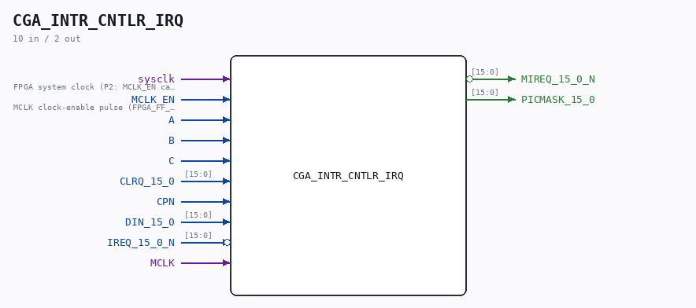

# CGA_INTR_CNTLR_IRQ

Source: `/mnt/e/Dev/Repos/Ronny/nd-120/Verilog/DELILAH-CPU/CGA_INTR/circuit/CGA_INTR_CNTLR_IRQ.v`

> Generated by `Verilog/tests/module_doc.py` from the `//!`
> comments in the source. Do not edit by hand - edit the RTL comments and regenerate.

## Description

ND120 CGA (CPU Gate Array / DELILAH)
/CGA/INTR/CNTLR/IRQ
IRQ
Interrupt latches
Mask register
Page 79
SHEET 1 of 1
Last reviewed: 23-MAR-2025
Ronny Hansen

## Ports

| Direction | Width | Name | Description |
|---|---|---|---|
| input | `1` | `sysclk` | FPGA system clock (P2: MCLK_EN capture) |
| input | `1` | `MCLK_EN` | MCLK clock-enable pulse (FPGA_FF_MODE, else 0) |
| input | `1` | `A` |  |
| input | `1` | `B` |  |
| input | `1` | `C` |  |
| input | `[15:0]` | `CLRQ_15_0` |  |
| input | `1` | `CPN` |  |
| input | `[15:0]` | `DIN_15_0` |  |
| input | `[15:0]` | `IREQ_15_0_N` *(active low)* |  |
| input | `1` | `MCLK` |  |
| output | `[15:0]` | `MIREQ_15_0_N` *(active low)* |  |
| output | `[15:0]` | `PICMASK_15_0` |  |
