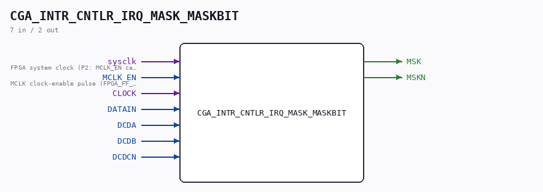

# CGA_INTR_CNTLR_IRQ_MASK_MASKBIT

Source: `/mnt/e/Dev/Repos/Ronny/nd-120/Verilog/DELILAH-CPU/CGA_INTR/circuit/CGA_INTR_CNTLR_IRQ_MASK_MASKBIT.v`

> Generated by `Verilog/tests/module_doc.py` from the `//!`
> comments in the source. Do not edit by hand - edit the RTL comments and regenerate.

## Description

ND120 CGA (CPU Gate Array / DELILAH)
/CGA/INTR/CNTLR/IRQ/MASK/MASKBIT
IRQ MASK BIT
Page 80
SHEET 1 of 1
Last reviewed: 10-NOV-2024
Ronny Hansen

## Ports

| Direction | Width | Name | Description |
|---|---|---|---|
| input | `1` | `sysclk` | FPGA system clock (P2: MCLK_EN capture) |
| input | `1` | `MCLK_EN` | MCLK clock-enable pulse (FPGA_FF_MODE, else 0) |
| input | `1` | `CLOCK` |  |
| input | `1` | `DATAIN` |  |
| input | `1` | `DCDA` |  |
| input | `1` | `DCDB` |  |
| input | `1` | `DCDCN` |  |
| output | `1` | `MSK` |  |
| output | `1` | `MSKN` |  |
